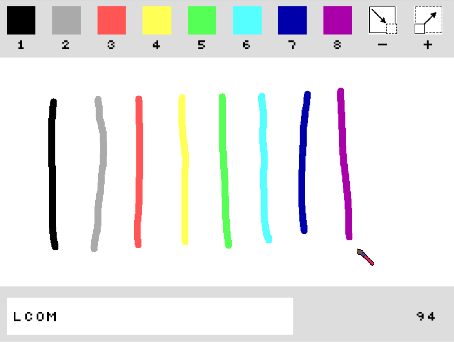
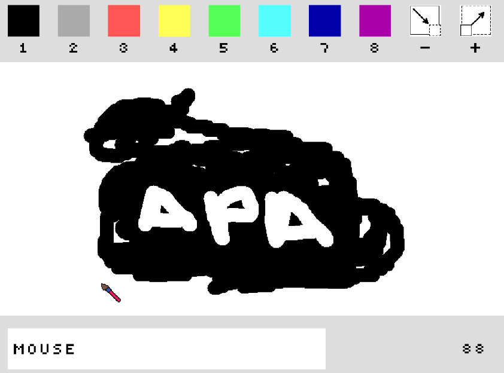

# Project "Gertic--" (Grade: 18.8 / 20)

Gertic-- is inspired by the well-known game [Gartic](https://gartic.io) and implemented to contain all devices taught in LCOM.

## Main features

### Many colors to paint with left mouse button

### Various thicknesses to paint

### Delete the drawing with the right mouse button

### Multiplayer mode, using serial port

Members:
- [x] Fábio Sá, up202007658 
- [x] Inês Gaspar, up202007210 
- [x] Lourenço Gonçalves, up202004816 
- [x] Marcos Pinto, up201800177