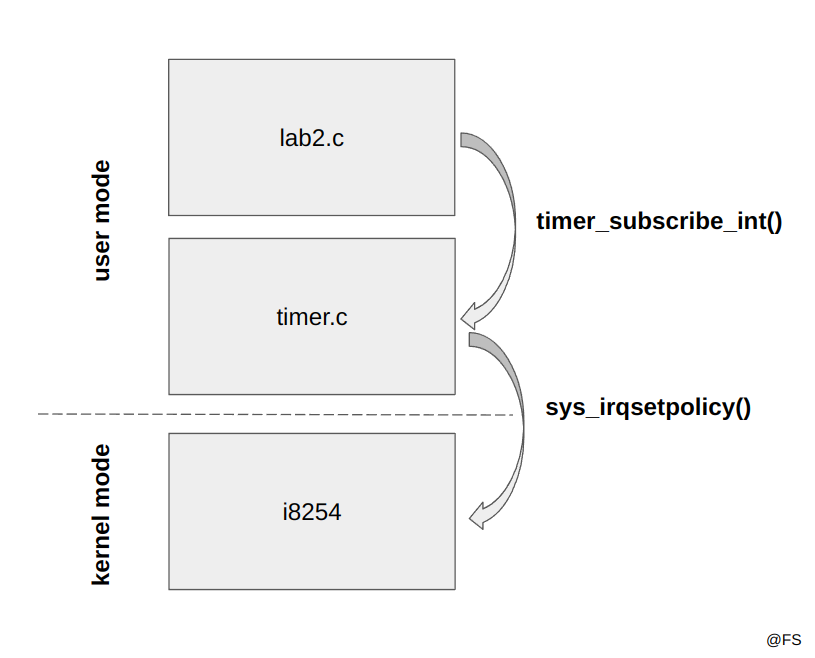
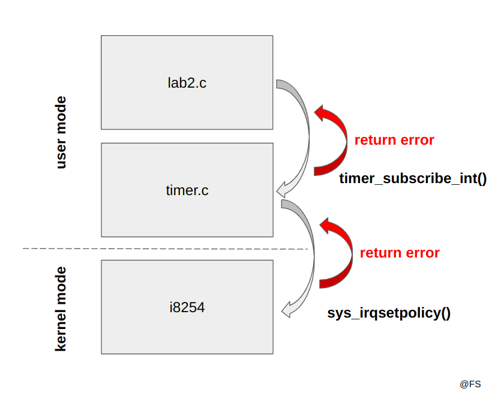

# Apontamentos e dicas gerais

## Tópicos 

- [Programação em C no contexto de LCOM](#programação-em-c-no-contexto-de-lcom)
- [Organização do código](#organização-do-código)

## Programação em C no contexto de LCOM

Em LCOM lidamos com a interface entre o software e o hardware. A escrita e leitura nesses dispositivos, embora virtualizada, pode resultar em erros principalmente quando executada em *kernel mode*. Portanto, é de evitar programação com funções void como demonstrado no seguinte exemplo:

```c
void timer_subscribe_int(uint8_t *bit_no) {
  *bit_no = BIT(hook_id); 
  sys_irqsetpolicy(TIMER0_IRQ, IRQ_REENABLE, &hook_id);
}

int main() {
    // ...
    uint8_t value;
    timer_subscribe_int(&value);
    // ...
    return 0;
}
```

<p align="center">
  
  <p align="center">Cadeia de chamadas sem retorno</p>
</p><br>

Se houver algum erro na cadeia de chamadas, a função principal não tem como saber e prosseguirá com as instruções seguintes. Imagine-se que devido a um erro na função `sys_irqsetpolicy` o valor de `value` não é validado. As operações seguintes ao nível das interrupções do timer estarão comprometidas e levarão a erros inesperados. <br>
O melhor é mesmo optar por retornar um valor indicativo:
- 0 se a operação foi bem sucedida;
- outro valor, por exemplo 1, se ocorreu algum erro;

Da mesma forma, também é de evitar que os valores de retorno das funções contenham algo útil para as instruções de execução do programa:

```c
uint8_t timer_subscribe_int() {
  *bit_no = BIT(hook_id); 
  sys_irqsetpolicy(TIMER0_IRQ, IRQ_REENABLE, &hook_id);
  return hook_id;
}

int main() {
    // ...
    uint8_t value = timer_subscribe_int();
    // ...
    return 0;
}
```

O resultado das operações deve ser mandado por apontador e o valor de retorno de cada função só indica se no processo houve algum erro:

```c
int timer_subscribe_int(uint8_t *bit_no) {
  *bit_no = BIT(hook_id); 
  if (sys_irqsetpolicy(TIMER0_IRQ, IRQ_REENABLE, &hook_id) != 0) return 1;
  return 0;
}

int main() {
    // ...
    uint8_t value;
    if (timer_subscribe_int(&value) != 0) return 1;
    // ...
    return 0;
}
```

<p align="center">
  
  <p align="center">Cadeia de chamadas com propagação do erro</p>
</p><br>

## Organização do código

// TODO

---

@ Fábio Sá <br>
@ Fevereiro de 2023