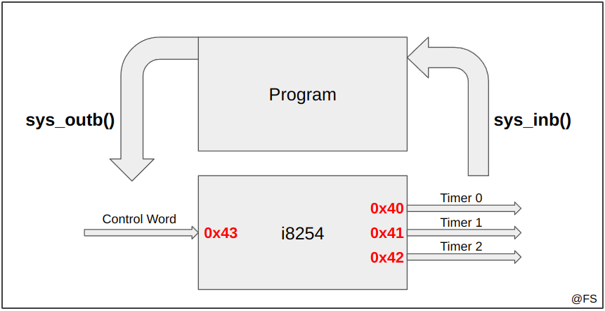
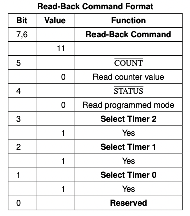
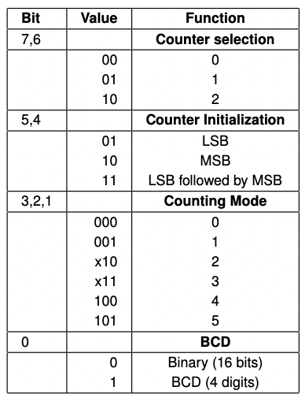

# i8254, the PC's Timer

## Tópicos

- [O que é o i8254](#i8254)
- [Control Word](#control-word)
- Alteração da frequência do Timer
- Interrupções
- Compilação do código
- Testagem do código implementado

### Anexos

- Modo binário vs. Modo BCD
- MSB vs. LSB
- Boas práticas de organização do código
- Boas práticas de programação em C no contexto de LCOM

## i8254

O temporizador do computador, também conhecido como i8254, é um dos mais básicos tipos de hardware que podemos programar na linguagem C. Com ele cada computador tem a funcionalidade de medir um tempo preciso sem depender da rapidez do processador.

O i8254 implementa internamente três contadores, cada um com 16 bits (*uint16_t*):
- `Timer 0`, no registo 0x40; 
- `Timer 1`, no registo 0x41;
- `Timer 2`, no registo 0x42; 

O registo 0x43, conhecido como `control register`, é reservado à comunicação com o dispositivo através de *system calls*.

Duas das *system calls* que vamos usar para este e outros dispositivos ao longo do semestre são as que se seguem. Os nomes foram atribuídos sob o ponto de vista do programa que usa o dispositivo:

- `sys_outb`, manda informação para o timer (como por exemplo uma nova configuração a ser seguida);
- `sys_inb`, recebe informação do timer (como por exemplo a configuração atual);

<p align="center">
  
  <p align="center">Funcionamento do i8254</p>
</p><br>

Na linguagem C as duas funções têm a seguinte estrutura:

```c
/**
 * @port - registo do timer que vai receber o comando (Ox40, 0x41, 0x42, 0x43)
 * @command - comando ou valor a escrever na porta selecionada
 */
int sys_outb(uint8_t port, uint32_t command);

/**
 * @port - porta do timer a consultar (0x40, 0x41, 0x42)
 * @value - será preenchido pelo valor lido do timer escolhido em @port
 */
int sys_inb(uint8_t port, uint32_t *value);
```

### Erro típico #1 - Tipo dos argumentos

Note-se que o segundo argumento de `sys_inb` é um apontador para um inteiro de 32 bits. No contexto de LCOM só serão necessários 8 bits (1 byte) e essa diferença muitas vezes leva a erros desnecessários. Aconselha-se por esse motivo à implementação e utilização de uma função auxiliar que funciona como uma interface entre os dois tipos:

```c
int util_sys_inb(int port, uint8_t *value) {
  if (value == NULL) return 1;   // o apontador deve ser válido
  uint32_t val;                  // variável auxiliar de 32 bits
  int ret = sys_inb(port, &val); // val ficará com o valor lido de port
  *value = 0xFF & val;           // value ficará apenas com os primeiros 8 bits do resultado lido
  return ret;
}
```

No caso de `sys_outb` esse problema já não acontece. De facto um comando de 8 bits (uint8_t) é equivalente a um comando de 32 bits (uint32_t) com os 24 bits mais significativos a 0, o que acontece quando declaramos a variável.

### Erro típico #2 - Leituras inválidas

Sempre que quisermos algo do Timer (ler configurações, introduzir uma nova configuração, atualizar o contador interno) é preciso primeiro avisá-lo, escrevendo no registo de controlo (0x43) a ControlWord adequada. A leitura direta de qualquer um dos registos dos contadores (0x40, 0x41, 0x42) dá origem a erros e a valores errados. Assim, antes de qualquer operação de leitura `sys_inb()` é necessário uma escrita `sys_outb()`.

Exemplo:

Imagine-se que o comando `0b01001011`, ou `0x75` em hexadecimal, permite avisar o i8254 que vamos ler a configuração atual do Timer 1 (presente em `0x41`). O código correspondente dessa ação será:

```c
sys_outb(0x43, 0x75);               // avisar o i8254 pelo registo de controlo 0x43 com o comando adequado
uint8_t configuration;
util_sys_inb(0x41, &configuration); // ler a configuração diretamente do timer 1, 0x41
printf("A configuração atual do Timer1 é %02x\n", configuration);
```

## Control Word

As informações enviadas ao i8254 através do registo 0x43 são muitas vezes comandos de controlo. Cada comando de controlo, chamado de `control word`, possui apenas 8 bits e têm uma construção bastante restritiva:

### Para leitura da configuração de um Timer ou o valor do contador -> Read-Back Command

<p align="center">
  
  <p align="center">Construção do Read-Back Command</p>
</p>

#### Exemplo

Queremos ler a **configuração** do Timer 2. Assim, o comando a enviar será do modo:

```c
// BIT(7) e BIT(6) - Ativação da opção Read-Back, para podermos ler depois
// BIT(5) - Desativação da leitura do contador. Só queremos ler a configuração.
// BIT(3) - Como queremos ler o Timer 2, ativamos o BIT 3
uint8_t command = BIT(7) | BIT(6) | BIT(5) | BIT(3); // 11101000
```

### Para configurar o Timer -> Configuration Command

<p align="center">
  
  <p align="center">Construção do Configuration Command. Considerar X = 0 por questões de compatibilidade.</p>
</p><br>

### Erro típico #3 - Configurações incompletas

Exemplo: