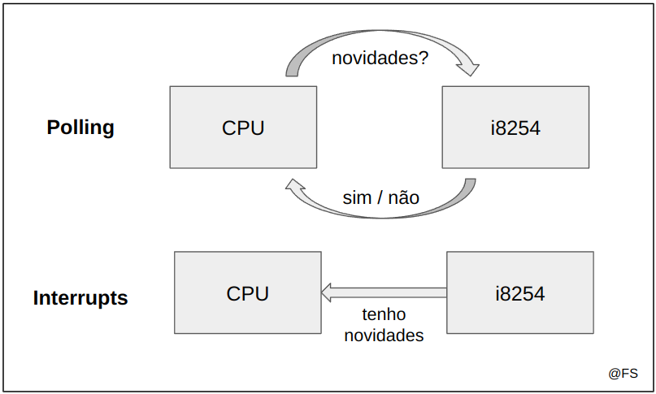

# i8254, the PC's Timer

## Tópicos

- [O que é o i8254](#i8254)
- [Control Word](#control-word)
- [Interrupções](#interrupções)
- [Compilação do código](#compilação-do-código)
- [Testagem do código](#testagem-do-código)

## i8254

O temporizador do computador, também conhecido como i8254, é um dos mais básicos tipos de hardware que podemos programar na linguagem C. Com ele cada computador tem a funcionalidade de medir um tempo preciso sem depender da rapidez do processador.

O i8254 implementa internamente três contadores, cada um com 16 bits (*uint16_t*):
- `Timer 0`, no registo 0x40, serve para providenciar uma base de tempo;
- `Timer 1`, no registo 0x41, serve para refrescar a memória DRAM;
- `Timer 2`, no registo 0x42, serve para gerar tons e frequências para os *speakers* do computador;

O registo 0x43, conhecido como `control register`, é reservado à comunicação com o dispositivo através de *system calls*.

Duas das *system calls* que vamos usar para este e outros dispositivos ao longo do semestre são as que se seguem. Os nomes foram atribuídos sob o ponto de vista do programa que usa o dispositivo:

- `sys_outb`, manda informação para o timer (como por exemplo uma nova configuração a ser seguida);
- `sys_inb`, recebe informação do timer (como por exemplo a configuração atual);

<p align="center">
  
  <p align="center">Funcionamento do i8254</p>
</p><br>

Na linguagem C as duas funções têm a seguinte estrutura:

```c
/**
 * @port - registo do timer que vai receber o comando (Ox40, 0x41, 0x42, 0x43)
 * @command - comando ou valor a escrever na porta selecionada
 */
int sys_outb(uint8_t port, uint32_t command);

/**
 * @port - porta do timer a consultar (0x40, 0x41, 0x42)
 * @value - será preenchido pelo valor lido do timer escolhido em @port
 */
int sys_inb(uint8_t port, uint32_t *value);
```

### Erro típico #1 - Tipo dos argumentos

Note-se que o segundo argumento de `sys_inb` é um apontador para um inteiro de 32 bits. No contexto de LCOM só serão necessários 8 bits (1 byte) e essa diferença muitas vezes leva a erros desnecessários. Aconselha-se por esse motivo à implementação e utilização de uma função auxiliar que funciona como uma interface entre os dois tipos:

```c
int util_sys_inb(int port, uint8_t *value) {
  if (value == NULL) return 1;   // o apontador deve ser válido
  uint32_t val;                  // variável auxiliar de 32 bits
  int ret = sys_inb(port, &val); // val ficará com o valor lido de port
  *value = 0xFF & val;           // value ficará apenas com os primeiros 8 bits do resultado lido
  return ret;
}
```

No caso de `sys_outb` esse problema já não acontece. De facto um comando de 8 bits (uint8_t) é equivalente a um comando de 32 bits (uint32_t) com os 24 bits mais significativos a 0, o que acontece quando passamos a variável inicial para a função: a *system call* aloca 32 bits e depois copia o valor da variável para essa zona.

### Erro típico #2 - Leituras inválidas

Sempre que quisermos algo do Timer (ler configurações, introduzir uma nova configuração, atualizar o contador interno) é preciso primeiro avisá-lo, escrevendo no registo de controlo (0x43) a ControlWord adequada. A leitura direta de qualquer um dos registos dos contadores (0x40, 0x41, 0x42) dá origem a erros e a valores errados. Assim, antes de qualquer operação de leitura `sys_inb()` é necessário uma escrita `sys_outb()`.

Exemplo:

Imagine-se que o comando `0b01001011`, ou `0x75` em hexadecimal, permite avisar o i8254 que vamos ler a configuração atual do Timer 1 (presente em `0x41`). O código correspondente dessa ação será:

```c
sys_outb(0x43, 0x75);               // avisar o i8254 pelo registo de controlo 0x43 com o comando adequado
uint8_t configuration;
util_sys_inb(0x41, &configuration); // ler a configuração diretamente do timer 1, 0x41
printf("A configuração atual do Timer1 é %02x\n", configuration);
```

## Control Word

As informações enviadas ao i8254 através do registo 0x43 são muitas vezes comandos de controlo. Cada comando de controlo, chamado de `control word`, possui apenas 8 bits e têm uma construção bastante restritiva:

### Para leitura da configuração de um Timer ou o valor do contador -> Read-Back Command

<p align="center">
  
  <p align="center">Construção do Read-Back Command</p>
</p>

#### Exemplo 1:

Queremos ler a **configuração** do Timer 2. O conjunto de instruções a tomar será o seguinte:

```c
// BIT(7) e BIT(6) - Ativação da opção Read-Back, para podermos ler depois
// BIT(5) - Desativação da leitura do contador. Só queremos ler a configuração.
// BIT(3) - Como queremos ler o Timer 2, ativamos o BIT 3
uint8_t command = BIT(7) | BIT(6) | BIT(5) | BIT(3); // 11101000 = 0xE8
sys_outb(0x43, 0xE8);             
uint8_t configuration;
util_sys_inb(0x42, &configuration);
printf("A configuração atual do Timer2 é %02x\n", configuration);
```

### Para configurar o Timer -> Configuration Command

<p align="center">
  
  <p align="center">Construção do Configuration Command.</p>
</p><br>

Em LCOM seguiremos quase sempre estas configurações:
- Counter initialization: 11, LSB followed by MSB;
- BCD: 0, queremos o contador em modo binário de 16 bits;
- Onde aplicável, X = 0, por questões de compatibilidade em versões posteriores de dispositivos Intel;
- Counting Mode 3;

Após a escrita do comando de configuração no registo de controlo, 0x43, é necessário injetar o valor inicial no contador pela porta correspondente (0x40, 0x41 ou 0x42).
Cada timer do i8254 possui um valor interno que é decrementado de acordo com a frequência do CPU. No caso do Minix é decrementado 1193182 vezes por segundo. Sempre que o valor do contador fica a 0 o dispositivo avisa o CPU (gera uma **interrupção**, algo a estudar em breve) e volta ao valor original. 

Por exemplo, para um CPU de frequência 100 Hz e um Timer de 4 Hz precisavamos de ter o contador com valor 25. Esquema ilustrativo:

<p align="center">
  
  <p align="center">Cálculo do valor do contador interno</p>
</p><br>

Para configurar a frequência do timer selecionado, de modo a conseguirmos por exemplo contar segundos (com uma frequência de 60Hz) através das interrupções geradas, devemos calcular o valor interno.

```c
#define TIMER_FREQUENCY 1193182
uint16_t timer_frequency = 60;
uint16_t counter = TIMER_FREQUENCY / timer_frequency;
```

Com o valor interno calculado podemos colocá-lo no timer. Como se trata tipicamente de um valor de 16 bits, então devemos separá-lo em dois valores (MSB e LSB) através de funções auxiliares e só depois enviar LSB seguido de MSB. Essas funções são definidas no ficheiro `util.c`:

```c
// LSB -> Less Significant Bits
int util_get_LSB (uint16_t val, uint8_t *lsb) {
  if (lsb == NULL) return 1; // O apontador deve ser válido
  *lsb = 0xFF & val;         // Coloca no apontador os 8 bits menos significativos do valor
  return 0;
}

// MSB -> Most Significant Bits
int util_get_MSB (uint16_t val, uint8_t *msb) {
  if (msb == NULL) return 1; // O apontador deve ser válido
  *msb = (val >> 8) & 0xFF;  // Coloca no apontador os 8 bits mais significativos do valor
  return 0;
}
```

### Erro típico #3 - Configurações incompletas

Por segurança só devemos modificar as configurações que necessitamos mesmo, deixando os outros bits iguais aos que o Sistema Operativo decidiu. Uma forma simples de contornar a situação é consultar primeiro a configuração atual do dispositivo e só depois modificar o desejado.

#### Exemplo 2:

Queremos configurar o Timer 1 com frequência de 60Hz. O conjunto de instruções a tomar será o seguinte:

```c
// Consultar a configuração atual do Timer 1
uint8_t readback_command = = BIT(7) | BIT(6) | BIT(5) | BIT(2); // 11100100 = 0xE4
sys_outb(0x43, 0xE4);             
uint8_t old_configuration, new_configuration;
util_sys_inb(0x41, &old_configuration);

// Novo comando de configuração, mantemos os 4 bits menos significativos
// ativamos os bits da zona 'LSB followed by MSB' e acionamos o BIT(6) que indica que vamos configurar o Timer 1
new_configuration = (old_configuration & 0x0F) | BIT (5) | BIT(4) | BIT(6);

// Cálculo do valor inicial do contador e partes mais e menos significativas
uint16_t initial_value = TIMER_FREQUENCY / 60;
uint8_t lsb, msb;
util_get_lsb(initial_value, &lsb);
util_get_msb(initial_value, &msb);

// Avisamos o i8254 que vamos configurar o Timer 1
sys_outb(0x43, new_configuration);

// Injetamos o valor inicial do contador (lsb seguido de msb) diretamente no registo 0x41 (Timer 1)
sys_outb(0x41, lsb);
sys_outb(0x41, msb);
```

### Erro típico #4 - Validação da Frequência

Como vimos em cima é importante validar todos os inputs das funções a implementar. Vimos também que valor do contador interno de cada timer é dado pela expressão:

```c
uint16_t counter = TIMER_FREQ / freq
```

Para validarmos a frequência pedida (freq) temos duas coisas a ter em conta:
- a frequência não pode ser superior a TIMER_FREQ
- a frequência não pode ser inferior a 19

Porque é que o limite é 19? Vamos fazer as contas ao contrário:

- o valor do contador pode ser, no máximo, 2^16 = 65536
- TIMER_FREQ para o minix é sempre 1193182
- fazendo as contas ao contrário temos que freq = 1193182 / 65536 = 18.2

Assim, o Minix não suporta frequências inferiores a 19 pois o contador a partir de um certo ponto dá **overflow**. Uma possível implementação desta validação é a seguinte:

```c
#define TIMER_FREQ 1193182

int timer_set_frequency (uint8_t timer, uint32_t freq) {
  if (freq > TIMER_FREQ || freq < 19) return 1;
  //...
  return 0;
}
```

## Interrupções

A interação entre o CPU e os dispositivos I/O pode ser de duas formas:

`Polling`: o CPU monitoriza o estado do dispositivo periodicamente e quando este tiver alguma informação útil ao sistema essa informação é tratada. Desvantagem: *busy waiting*, gasta muitos ciclos de relógio só na monitorização. É usado principalmente em dispositivos de baixa frequência de utilização.

`Interrupções`: é o dispositivo que inicia a interação. Quando este tiver alguma informação útil ao sistema envia um sinal (um booleano por exemplo) através de uma interrupt request line específica, `IRQ_LINE`.

<p align="center">
  
  <p align="center">Polling vs. Interrupts</p>
</p><br>

Em LCOM os dispositivos a implementar contêm a opção de interrupções com uma IRQ_LINE representada por vários bits. O mais indicado é utilizar os bits menos significativos para os dispositivos de maior frequência e maior importância, como é o caso do i8254. **Nunca utilizar o mesmo bit para dois ou mais dispositivos**. <br>
Para ativar as interrupções é necessário subscrevê-las através de uma *system call* e antes de acabar o programa deve-se desligar as interrupções usando outra, para garantir a reposição do estado inicial da máquina. Por norma o bit de interrupção é definido pelo módulo que gere o próprio dispositivo, para que seja independente do programa:

```c
/* ------ i8254.h ------ */
#define TIMER0_IRQ 0;   

/* ------ timer.c ------ */
int timer_hook_id = 0;

// subscribe interrupts
int timer_subscribe_int (uint8_t *bit_no) {
  if(bit_no == NULL) return 1;   // o apontador tem de ser válido
  *bit_no = BIT(timer_hook_id);  // a função que chamou esta deve saber qual é a máscara a utilizar
                                 // para detectar as interrupções geradas
  return sys_irqsetpolicy(TIMER0_IRQ, IRQ_REENABLE, &timer_hook_id); // subscrição das interrupções
}

// unsubscribe interrupts
int timer_unsubscribe_int () {
  return sys_irqrmpolicy(&timer_hook_id); // desligar as interrupções
}
```

### Erro típico #5 - Subscrição de Interrupções

Para não haver enganos na função `sys_irqsetpolicy`:
- o primeiro argumento descreve a IRQ_LINE a usar, o seu valor é sempre dado no enunciado e pode variar entre 0 e 15;
- o segundo argumento é, para o caso de i8254, IRQ_REENABLE. É um tipo de política que permite recebermos sinais do tipo EOI (*End Of Interrupt*) e a partir deles tratar correctamente as interrupções;
- o terceiro argumento é um apontador para um inteiro de valor arbitrário, à escolha do aluno, que pode variar entre 0 e 7. Entre dispositivos diferentes estes valores têm de ser também diferentes. Este valor deve ser declarado como inteiro e global no ficheiro da implementação do módulo.

Repare-se também na ordem de implementação da função `timer_subscribe_int`:
- validação do input;
- construção da máscara;
- invocação da *system call*;

A troca da ordem das últimas instruções dá origem a **erro**, uma vez que o terceiro argumento da system call funciona de duas formas:
- Input: indica ao hardware o bit a ativar na IRQ_LINE assim que ocorrer uma interrupção;
- Output: recebe um identificador para ser usado ao desativar as interrupções;

Assim é expectável que depois de invocarmos a *system call* o valor da variável `timer_hook_id` já não seja 0 e sim algo aleatório, e por isso não podemos depois construir a máscara.

### Exemplo 3:

Imagine-se que um programa em LCOM utiliza três dispositivos: timer, rato e teclado. A descrição dos `hook_id` dos dispositivos usados é a seguinte:

```c
int hook_id_timer = 0;
int hook_id_mouse = 1;
int hook_id_keyboard = 2;
```

O CPU, num determinado momento, obteve o valor 5 na IRQ_LINE. Para descobrir os dispositivos que foram ativados é necessário olhar os bits constituintes:

```c
irq_line = 5; // ...00000101
```

Assim conclui-se que houve interrupções do timer (bit 0) e do teclado (bit 2). Em termos de código em C é possível verificar as interrupções dos dispositivos através de operações *bitwise*:

```c
if (irq_line & BIT(hook_id_timer)) printf("Timer interrupt!\n");
if (irq_line & BIT(hook_id_mouse)) printf("Mouse interrupt!\n");
if (irq_line & BIT(hook_id_keyboard)) printf("Keyboard interrupt!\n");
```

### Erro típico #6 - Tratamento incompleto das interrupções

Na realidade o tratamento de interrupções em C é mais verboso. O ciclo base, que é também dado nos testes de LCOM, é o seguinte:

```c
#include <lcom/lcf.h>
int ipc_status;
message msg;
while( 1 ) { /* You may want to use a different condition */
    /* Get a request message. */
    if( (r = driver_receive(ANY, &msg, &ipc_status)) != 0 ) {
      printf("driver_receive failed with: %d", r);
      continue;
    }
    if (is_ipc_notify(ipc_status)) { /* received notification*/
      switch (_ENDPOINT_P(msg.m_source)) {
        case HARDWARE: /* hardware interrupt notification */
          if (msg.m_notify.interrupts & irq_set) {
            /* process it */
          }
          break;
        default:
          break; /* no other notifications expected: do nothing */ 
      }
    } else { /* received a standard message, not a notification */ 
        /* no standard messages expected: do nothing */
    }
}
```

Uma implementação **errada** do exercício anterior poderia ser esta:

```c
// Subscrição das interrupções
timer_subscribe_int(&hook_id_timer);
mouse_subscribe_int(&hook_id_mouse);
keyboard_subscribe_int(&hook_id_keyboard);

while(<CONDITION>) {
    if( (r = driver_receive(ANY, &msg, &ipc_status)) != 0 ) {
      printf("driver_receive failed with: %d", r);
      continue;
    }
    if (is_ipc_notify(ipc_status)) { 
      switch (_ENDPOINT_P(msg.m_source)) {
        case HARDWARE:

          // Tratamento das interrupções

          if (msg.m_notify.interrupts & hook_id_timer) {
            printf("Timer interrupt!\n");
          } else if (msg.m_notify.interrupts & hook_id_mouse) {
            printf("Mouse interrupt!\n");
          } else if (msg.m_notify.interrupts & hook_id_keyboard) {
            printf("Keyboard interrupt!\n");
          } else {
            // Nothing
          }

          break;
        default:
          break;
      }
}

// Desativação das interrupções
timer_unsubscribe_int();
mouse_unsubscribe_int();
keyboard_unsubscribe_int();
```

Onde está o erro? Se forem geradas duas ou mais interrupções só a primeira será tratada (devido à condição **else if**). É por isso importante implementar as condições recorrendo sempre a **if**s. Além disso, como subscrever e desativar as interrupções dos dispositivos é gerida por *system calls* convém testar sempre o retorno:

```c
// Subscrição das interrupções
if (timer_subscribe_int(&hook_id_timer) != 0) return 1;
if (mouse_subscribe_int(&hook_id_mouse) != 0) return 1;
if (keyboard_subscribe_int(&hook_id_keyboard) != 0) return 1;

while(<CONDITION>) {
    if( (r = driver_receive(ANY, &msg, &ipc_status)) != 0 ) {
      printf("driver_receive failed with: %d", r);
      continue;
    }
    if (is_ipc_notify(ipc_status)) { 
      switch (_ENDPOINT_P(msg.m_source)) {
        case HARDWARE:

          // Tratamento das interrupções

          if (msg.m_notify.interrupts & hook_id_timer) {
            printf("Timer interrupt!\n");
          }
          if (msg.m_notify.interrupts & hook_id_mouse) {
            printf("Mouse interrupt!\n");
          }
          if (msg.m_notify.interrupts & hook_id_keyboard) {
            printf("Keyboard interrupt!\n");
          }

          break;
        default:
          break;
      }
}

// Desativação das interrupções
if (timer_unsubscribe_int() != 0) return 1;
if (mouse_unsubscribe_int() != 0) return 1;
if (keyboard_unsubscribe_int() != 0) return 1;
```

### Exemplo 4:

Para finalizar o módulo `i8254` temos um exercício mais completo. Queremos um programa que determine a quantidade de interrupções do teclado geradas em 10 segundos. O Timer 0 deve ser usado para esta tarefa. Uma possível solução seria a seguinte:

```c
int main() {

  uint16_t frequency = 60;
  uint16_t seconds = 10;
  uint8_t hook_id_timer, hook_id_keyboard, lsb, msb;

  // Consultar a configuração atual do Timer 0
  uint8_t readback_command = BIT(7) | BIT(6) | BIT(5) | BIT(1); // 11100010 = 0xE2
  if (sys_outb(0x43, 0xE2) != 0) return 1;             
  uint8_t old_configuration, new_configuration;
  if (util_sys_inb(0x40, &old_configuration) != 0) return 1;

  // Novo comando de configuração, ativamos os bits da zona 'LSB followed by MSB' e mantemos os 4 bits menos significativos
  // Como se trata da configuração do Timer 0 não ativamos mais nenhum bit (Bit 7 e Bit 6 ficam a 0).
  new_configuration = (old_configuration & 0x0F) | BIT (5) | BIT(4);

  // Cálculo do valor inicial do contador e partes mais e menos significativas
  uint16_t initial_value = TIMER_FREQUENCY / frequency;
  if (util_get_lsb(initial_value, &lsb) != 0) return 1;
  if (util_get_msb(initial_value, &msb) != 0) return 1;

  // Avisamos o i8254 que vamos configurar o Timer 0
  if (sys_outb(0x43, new_configuration) != 0) return 1;

  // Injetamos o valor inicial do contador (lsb seguido de msb) diretamente no registo 0x40 (Timer 0)
  if (sys_outb(0x40, lsb) != 0) return 1;
  if (sys_outb(0x40, msb) != 0) return 1;

  // Subscrição das interrupções dos dispositivos necessários
  if (timer_subscribe_int(&hook_id_timer) != 0) return 1;
  if (keyboard_subscribe_int(&hook_id_keyboard) != 0) return 1;

  // Um timer a 60Hz (60 interrupções por segundo) durante 10 segundos equivale a 60*10 interrupções
  uint8_t interrupt_limit = frequency * seconds; 
  uint8_t keyboard_interrupts = 0;
  uint8_t timer_interrupts = 0;

  while(timer_interrupts <= interrupt_limit) {
    if( (r = driver_receive(ANY, &msg, &ipc_status)) != 0 ) {
      printf("driver_receive failed with: %d", r);
      continue;
    }
    if (is_ipc_notify(ipc_status)) { 
      switch (_ENDPOINT_P(msg.m_source)) {
        case HARDWARE:

          if (msg.m_notify.interrupts & hook_id_timer) {
            timer_interrupts++;
          }

          if (msg.m_notify.interrupts & hook_id_keyboard) {
            keyboard_interrupts++;
          }

          break;
        default:
          break;
      }
    }
  }

  // Desativação das interrupções
  if (timer_unsubscribe_int() != 0) return 1;
  if (keyboard_unsubscribe_int() != 0) return 1;

  printf("Foram detetadas %d interrupções do teclado\n", keyboard_interrupts);
  return 0;
}
```

Porque é que o código verifica sempre os retornos das funções auxiliares e *system calls*? Ver apontamentos sobre as [boas práticas de programação em C no contexto de LCOM](../README.md).

## Compilação do código

Ao longo do Lab2 programamos em 4 ficheiros:

- `i8254.h`, para constantes e definição de macros úteis;
- `utils.c`, para as três funções úteis para este e para os outros labs: MSB, LSB e util_sys_inb;
- `timer.c`, para implementação das funções do módulo i8254;
- `lab2.c`, para implementação das funções de mais alto nível que usam as funções disponíveis no módulo;

Em LCOM o processo de compilação é simples pois existe sempre um makefile que auxilia na tarefa. Para compilar basta correr os seguintes comandos:

```bash
minix$ make clean # apaga os binários temporários
minix$ make       # compila o programa
```

## Testagem do código

A biblioteca LCF (*LCOM Framework*) disponível nesta versão do Minix3 tem um conjunto de testes para cada função a implementar em `lab2.c`. Assim é simples verificar se o programa corre como esperado para depois ser usado sem problemas no projeto. Para saber o conjunto dos testes disponíveis basta consultar:

```bash
minix$ lcom_run lab2
```

Neste caso em concreto estão disponíveis imensas combinações:

```bash
minix$ lcom_run lab2 "config <0,1,2> <all,init,mode,base> -t <0,1,2,3>"
minix$ lcom_run lab2 "time <0,1,2> <frequency> -t 0"
minix$ lcom_run lab2 "int <time> -t <0,1>"
```

O terceiro teste, aquele das interrupções e medição de tempo, não requer indicação do Timer (0, 1, 2). O motivo é simples: como vimos no início, o Timer 0 é o único responsável por nos dar uma base de tempo. É esse que será usado internamente.

---

@ Fábio Sá <br>
@ Fevereiro de 2023