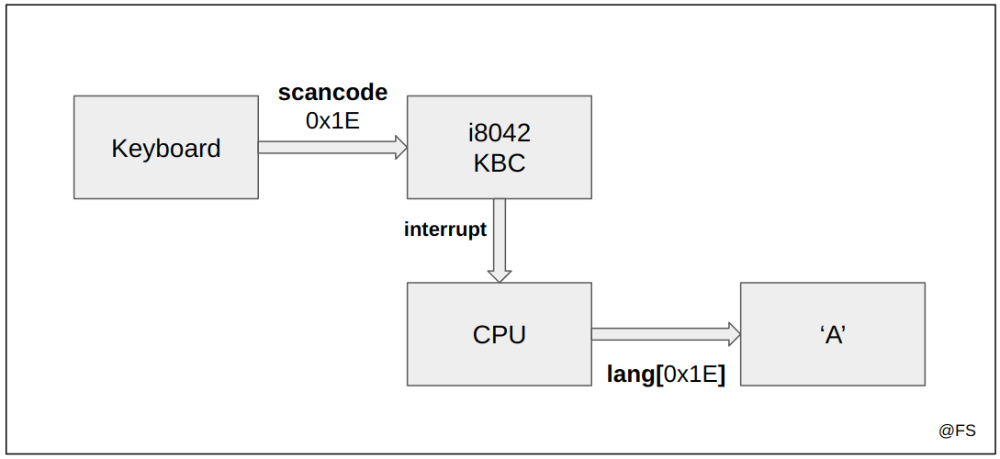
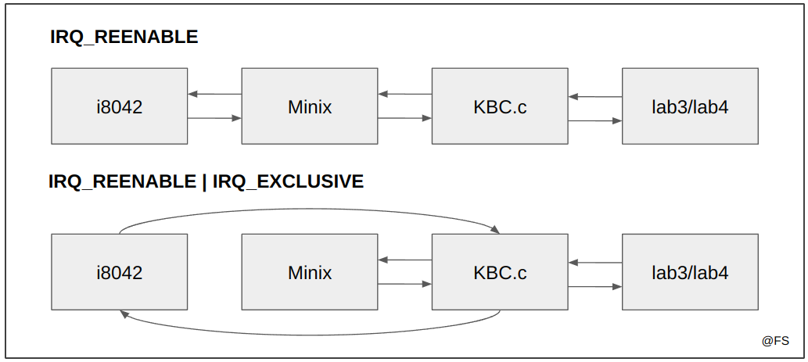

# i8042, the PC's Keyboard

## Tópicos

- [O teclado comum](#teclado)
- [i8042 KBC](#i8042-kbc)
- [Interrupções](#interrupções)
- [Polling](#polling)
- [Compilação do código](#compilação-do-código)
- [Testagem do código](#testagem-do-código)
- [Desafio #2 - Makecode SPAM](#desafio-2---makecode-spam), dificuldade 3/10
- [Desafio #3 - Teclas Presas](#desafio-3---teclas-presas), dificuldade 7/10

## Teclado

Como vimos no capítulo anterior há sempre necessidade de generalizar o hardware para poder ser usado com diversas máquinas. O teclado comum não foge da regra. Desta vez o desafio é diferente: há no mundo imensos fabricantes de teclados, com diferentes teclas, diferentes línguas e constituições. Como é possível generalizar todas estas combinações?

Quando pressionamos ou soltamos uma tecla geramos um `scancode`, que é um código geralmente de 8 bits (1 byte) que caracteriza não o significado da tecla mas sim a posição desta no teclado. Independentemente da língua, do fabricante ou do número de teclas, a mesma posição gera sempre o mesmo scancode. <br>
Este código é depois processado pelo i8042/KBC e interpretado pelo CPU. Antes de mostrar o output o CPU consulta a linguagem escolhida no sistema para fazer a tradução. Assim, quando trocamos a língua do teclado com recurso a software estamos na realidade a trocar o `keymap` da língua, implementado recorrendo por exemplo a *hashmaps* com chaves de bytes e valores em ASCII:

<p align="center">
  
  <p align="center">Tratamento do output do teclado</p>
</p><br>

Um scancode pode ter duas formas:
- `makecode`: código gerado quando pressionamos a tecla;
- `breakcode`: código gerado quando soltamos a tecla;

Geralmente o breakcode difere apenas no bit mais significativo do makecode original. Esta diferença fica mais nítida no caso anterior:

```c
uint8_t A_makecode  = 0x1E // 00011110
uint8_t A_breakcode = 0x9E // 10011110
```

Uma possível implementação de uma função que faz a distinção dos códigos:

```c
void evaluate_scancode(uint8_t scancode) {
    if (scancode & BIT(7)) {
        printf("%02x, breakcode!\n", scancode);
    } else {
        printf("%02x, makecode!\n", scancode);
    }
}
```

Algumas teclas possuem scancode de 2 bytes. Nesse caso é quase certo que o primeiro byte recebido seja `0xE0`.
Na versão que vamos utilizar em LCOM o Minix contém a linguagem portuguesa.

## i8042 KBC

O i8042 ou KBC (*KeyBoard Controller*) é o controlador do teclado do computador e do rato com dois botões. Neste lab focaremos apenas na funcionalidade do teclado. É importante desde já termos uma boa estrutura e hierarquia de dependências entre os vários ficheiros para que o sistema seja modular e reutilizável para o lab seguinte:

<p align="center">
  
  <p align="center">Estrutura do código esperada</p>
</p><br>

Este dispositivo funciona de forma parecida ao timer, havendo interação a partir da escrita e leitura de registos:

<p align="center">
  
  <p align="center">Funcionamento do i8042</p>
</p><br>

Desta vez temos a possibilidade de ler diretamente o status do dispositivo. Esse estado é constituído por 8 bits (uint8_t) e permite obter algumas informações relevantes:
- Se ocorreu um erro de `paridade`, o bit 7 está ativo;
- Se ocorreu um erro de `timeout`, o bit 6 está ativo;
- Se o buffer de entrada (*input buffer*) estiver cheio, o bit 1 está ativo;
- Se o buffer de saída (*output buffer*) estiver cheio, o bit 0 está ativo;

### Exemplo 1

Queremos saber se num determinado momento o buffer de input está cheio. Uma possível implementação seria a seguinte:

```c
uint8_t status;
util_sys_inb(0x64, &status);
if (status & BIT(1)) {
    printf("Full input buffer\n");
}
```

Dá ainda para enviar comandos a partir do *input buffer* disponível em 0x64 mas de uma forma diferente do timer. Agora há dois problemas a ter em conta:
- O buffer de entrada é finito, poderá estar cheio e nesse caso não é possível inserir um comando de controlo;
- O KBC (*keyboard controller*) é um pouco lento, na ordem dos milissegundos, pelo que é indispensável tentar algumas vezes todas as operações efetuadas com este dispositivo;

Uma boa solução é criar um ciclo de tentativas finitas e esperar alguns milissegundos entre fracassos. Normalmente 10 tentativas e 20 milissegundos entre cada uma é suficiente para ter sucesso na operação. **Só é possível escrever no controlador quando o buffer de entrada não está cheio**:

```c
int write_KBC_command(uint8_t port, uint8_t commandByte) {

    uint8_t status;
    uint8_t attemps = 10;

    while (attemps) {

        if (read_KBC_status(&status) != 0){             // lê o status
            printf("Error: Status not available!\n");
            return 1;
        }

        if ((status & BIT(1)) == 0){                    // o input buffer não está cheio, posso escrever
            if(sys_outb(port, commandByte) != 0){       // tentativa de escrita
                printf("Error: Could not write commandByte!\n");
                return 1;
            }
            return 0; // sucesso: comando inserido no i8042
        }
        tickdelay(micros_to_ticks(20000));              
        attemps--;
    }
    return 1; // se ultrapassar o número de tentativas lança um erro
}
```

A função `tickdelay()` assegura o intervalo correcto entre tentativas de acordo os *ticks* do processador. A função `micros_to_ticks()` traduz um número inteiro de microsseguros em *ticks*.

Da mesma forma, dá para ler os caracteres pressionados no teclado graças ao buffer de saída. Note-se agora que a informação disponibilizada pelo i8042 é só fiável quando estiver completamente no buffer, ou seja, **só deve ser lida quando o output buffer estiver cheio**. O status indica se há algum erro ao nível da paridade ou de timeout. Nesse caso os bytes devem ser lidos para sairem da fila/buffer mas serem descartados:

```c
int read_KBC_output(uint8_t port, uint8_t *output) {

    uint8_t status;
    uint8_t attemps = 10;
    
    while (attemps) {

        if (read_KBC_status(&status) != 0) {                // lê o status
            printf("Error: Status not available!\n");
            return 1;
        }

        if ((status & BIT(0)) != 0) {                       // o output buffer está cheio, posso ler
            if(util_sys_inb(port, output) != 0){            // leitura do buffer de saída
                printf("Error: Could not read output!\n");
                return 1;
            }
            if((status & BIT(7)) != 0){                     // verifica erro de paridade
                printf("Error: Parity error!\n");           // se existir, descarta
                return 1;
            }
            if((status & BIT(6)) != 0){                     // verifica erro de timeout
                printf("Error: Timeout error!\n");          // se existir, descarta
                return 1;
            }
            return 0; // sucesso: output lido sem erros de timeout ou de paridade
        }
        tickdelay(micros_to_ticks(20000));
        attemps--;
    }
    return 1; // se ultrapassar o número de tentativas lança um erro
}
```

## Interrupções

O i8042 também dá origem a interrupções sempre que uma tecla é pressionada. O dispositivo está disponível na IRQ_LINE 1 e as interrupções são ativadas e eliminadas com comandos semelhantes ao Timer:

```c
/* ------ i8042.h ------ */
#define KEYBOARD_IRQ 1;   

/* ------ keyboard.c ------ */
int keyboard_hook_id = 1;

// subscribe interrupts
int keyboard_subscribe_int (uint8_t *bit_no) {
  if(bit_no == NULL) return 1;      // o apontador tem de ser válido
  *bit_no = BIT(keyboard_hook_id);  // a função que chamou esta deve saber qual é a máscara a utilizar
                                    // para detectar as interrupções geradas
  // subscrição das interrupções em modo exclusivo
  return sys_irqsetpolicy(KEYBOARD_IRQ, IRQ_REENABLE | IRQ_EXCLUSIVE, &keyboard_hook_id);
}

// unsubscribe interrupts
int keyboard_unsubscribe_int () {
  return sys_irqrmpolicy(&keyboard_hook_id); // desligar as interrupções
}
```

<p align="center">
  
  <p align="center">Modo exclusivo</p>
</p><br>


Note-se a diferença no segundo argumento da *policy*. O Minix tem um controlador próprio que recebe primeiro do que a nossa função as interrupções do teclado. Como não queremos isso, ou seja, queremos que a IRQ_LINE seja exclusivamente tratada pela nossa função, então declaramos estas interrupções como **exclusivas**, com a flag IRQ_EXCLUSIVE.

Como detetar e trabalhar com interrupções de vários dispositivos ao mesmo tempo? Ver [apontamentos do lab anterior](../lab2/README.md#erro-típico-6---tratamento-incompleto-das-interrupções).

## Polling

Neste atividade também teremos a oportunidade de trabalhar com o teclado em modo Polling. Como já vimos esta técnica é pouco eficiente pelo que aconselha-se a usar apenas na função `kbd_test_poll()` e não como solução a implementar no futuro projeto.

Nesta função em específico para o Minix permitir o Polling desativa todas as suas interrupções internas. Assim, é de extrema relevância antes de terminar a execução da mesma ativar novamente tudo, caso contrário o teclado deixará de responder aos comandos seguintes e a única solução será voltar a abrir o Minix. A função que trata dessa parte será a `kbc_restore()`. <br>
Tal como aconteceu no Timer, não queremos mexer em toda a configuração do teclado mas sim numa parte que faça ativar as interrupções. Dados relevantes a reter:

- O comando para avisar o i8042 de uma leitura de commandWord é 0x20;
- O comando para avisar o i8042 de uma escrita de commandWord é 0x60;
- As interrupções estão ativas se a commandWord tiver o Bit 0 ativo;

Uma possível implementação da função é a seguinte:

```c
int kbc_restore() {

    uint8_t commandWord;

    // Leitura da configuração atual
    if (write_KBC_command(0x64, 0x20) != 0) return 1;           // avisar o i8042 da leitura
    if (read_KBC_command(0x60, &commandWord) != 0) return 1;    // ler a configuração

    // Ativar o bit das interrupções
    commandWord = commandWord | BIT(0);

    // Escrita da nova configuração
    if (write_KBC_command(0x64, 0x60) != 0) return 1;           // avisar o i8042 da escrita
    if (write_KBC_command(0x60, commandWord) != 0) return 1;    // escrever a configuração
    return 0;
}
```

## Compilação do código

Ao longo do Lab3 programamos em 4 ficheiros:

- `i8042.h`, para constantes e definição de macros úteis ao sistema;
- `KBC.c`, para implementação das funções que contactam diretamente com o i8042 para leitura e escrita de comandos e leitura do status do dispositivo;
- `keyboard.c`, para implementação das funções referentes a interrupções, leitura de scancodes e reestabelecimento das interrupções em modo manual;
- `lab3.c`, para implementação das funções de mais alto nível que usam as funções disponíveis no módulo do *keyboard*;

Ainda importamos os ficheiros `utils.c`, `timer.c` e `i8254.h` do lab anterior. Em LCOM o processo de compilação é simples pois existe sempre um makefile que auxilia na tarefa. Para compilar basta correr os seguintes comandos:

```bash
minix$ make clean # apaga os binários temporários
minix$ make       # compila o programa
```

## Testagem do código

A biblioteca LCF (*LCOM Framework*) disponível nesta versão do Minix3 tem um conjunto de testes para cada função a implementar em `lab3.c`. Assim é simples verificar se o programa corre como esperado para depois ser usado sem problemas no projeto. Para saber o conjunto dos testes disponíveis basta consultar:

```bash
minix$ lcom_run lab3
```

Neste caso em concreto estão disponíveis algumas combinações:

```bash
minix$ lcom_run lab3 "scan -t <0,1,2,3,4,5>"
minix$ lcom_run lab3 "poll -t <0,1,2,3,4,5>"
minix$ lcom_run lab3 "timed <time> -t <0,1,2,3,4,5>"
```

### Dica

Para implementação do futuro projeto não temos disponível nenhuma tabela que relacione os scancodes às respetivas teclas do teclado. Aconselho por isso a correr livremente o comando seguinte e ir apontando os valores resultantes (makecodes preferencialmente) para todas as teclas que necessitem:

```bash
minix$ lcom_run lab3 "scan"
```

## Desafio #2 - Makecode SPAM

Este desafio foi inspirado num jogo da [Microsoft Arcade](https://arcade.makecode.com/88877-42759-87414-70617) e tem dificuldade 3/10. O jogo apresentado consiste em clicar numa tecla maior número de vezes durante um determinado tempo. O clique é considerado válido quando pressionamos e soltamos a tecla, ou seja, detectando um *makecode* seguido de um *breakcode*.

A função a implementar tem três argumentos:
- time: tempo em segundos da duração do jogo
- makecode: o makecode da tecla a pressionar
- record: o valor anterior do record obtido

```c
int spam(uint8_t time, uint8_t makecode, uint8_t record) {
    // to implement
    return 1;
}
```

A invocação da função resulta numa jogada onde pode ser batido o record anterior. Se não for batido o record a função deve retornar 0, caso contrário deve retornar o novo valor. A solução reune os conhecimentos obtidos nas aulas [Lab2](../lab2/) sobre o Timer e [Lab3](.) sobre o Teclado.

## Desafio #3 - Teclas Presas

O Sistema Operativo Windows contém uma ferramenta de acessibilidade chamada "Teclas Presas". Este recurso faz com que uma tecla modificadora fique ativa até que outra seja pressionada, permitindo aos utilizadores pressionarem uma tecla de cada vez para usar um atalho de teclado. Por exemplo, com esta opção ativa é possível tirar uma *screenshot* clicando nas teclas "Win", "Shift" e "S" sem ser ao mesmo tempo, desde que sejam cliques consecutivos.

A função a desenvolver em ambiente Minix deve retornar apenas quando for interpretado o comando "LCOM":

```c
int read_lcom_command() {
    // 
    return 1;
}
```

A solução reune os conhecimentos obtidos nas aula [Lab3](.) sobre o Teclado. Igualmente é necessário algum conhecimento prévio de Máquinas de Estado, por exemplo através da Unidade Curricular de Teoria da Computação, para simplificar o código.

### Dica

Um estado em C pode ser implementado recorrendo a enumerações:

```c
typedef enum {
    START,
    LETTER_L, LETTER_C, LETTER_O, LETTER_M,
    END
} CommandState;
```

Uma máquina de estado pode ser implementada por um ciclo que só acaba quando chegamos ao *estado terminal*. As transições correspondem a mudanças na variável que guarda o estado atual da máquina:

```c
CommandState state = START; // estado inicial

while (state != END) {  // enquanto não chegar ao estado terminal

    get_scancode(&scancode); // lê o próximo caracter do teclado

    switch (state) {
        case START:     
            // se a tecla pressionada for "L" então avança de estado, senão continua no estado inicial
            if (scancode == L_MAKECODE) { 
                state = LETTER_L;
            }
            break;
        
        case LETTER_L:
            if (scancode == L_MAKECODE || scancode == L_BREAKCODE) {
                // se a tecla continuar a ser "L", continua neste estado
                continue;
            } else if (scancode == C_MAKECODE) {
                // se a tecla for "C", avança de estado
                state = LETTER_C;
            } else {
                // se não for "L" ou "C", então recomeça o comando, volta ao estado inicial
                state = START;
            }

        // ...

        case END:
            break;
    }
}
```

A implementação de Máquinas de Estado em C será de extrema importância para a realização do Projeto final.

---

@ Fábio Sá <br>
@ Fevereiro de 2023