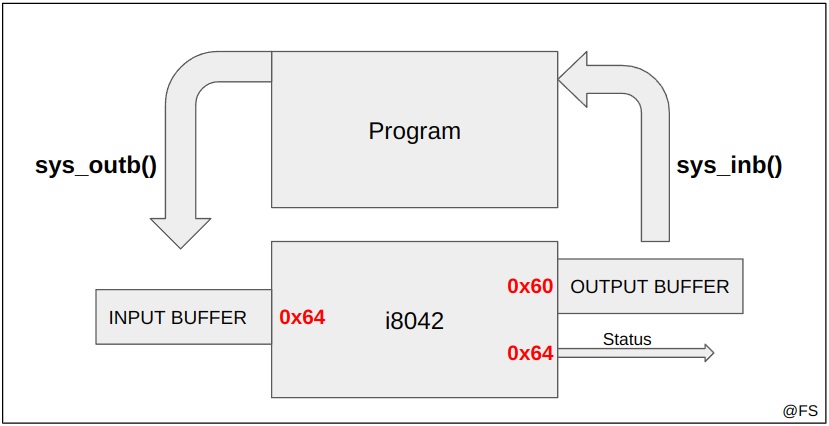

# i8042, the PC's Keyboard

## Tópicos

- [O que é o i8042](#i8042)
- [Interrupções](#interrupções)
- [Polling](#polling)
- [Compilação do código](#compilação-do-código)
- [Testagem do código](#testagem-do-código)

## i8042

Controlador do teclado do computador e do rato com dois botões. Neste lab focaremos apenas na funcionalidade do teclado. Este dispositivo funciona de forma parecida ao timer, havendo interação a partir da escrita e leitura de registos:

<p align="center">
  
  <p align="center">Funcionamento do i8042</p>
</p><br>

Desta vez temos a possibilidade de ler diretamente o status do dispositivo. Esse estado é constituído por 8 bits (uint8_t) e permite obter algumas informações relevantes:
- Se ocorreu um erro de `paridade`, o bit 7 está ativo;
- Se ocorreu um erro de `timeout`, o bit 6 está ativo;
- Se o buffer de entrada (*input buffer*) estiver cheio, o bit 1 está ativo;
- Se o buffer de saída (*output buffer*) estiver cheio, o bit 0 está ativo;

```c
uint8_t status;
util_sys_inb(0x64, &status);
if (status & BIT(1)) {
    printf("Full input buffer\n");
}
```

Dá ainda para enviar comandos a partir do *input buffer* disponível em 0x64 mas de uma forma diferente do timer. Agora há dois problemas a ter em conta:
- O buffer de entrada é finito, poderá estar cheio e nesse caso não é possível inserir um comando de controlo;
- O KBC (*keyboard controller*) é um pouco lento, na ordem dos milissegundos, pelo que é indispensável tentar algumas vezes todas as operações efetuadas com este dispositivo;

Uma boa solução é criar um ciclo de tentativas finitas e esperar alguns milissegundos entre fracassos. Normalmente 10 tentativas e 20 milissegundos entre cada uma é suficiente para ter sucesso na operação. **Só é possível escrever no controlador quando o buffer de entrada não está cheio**:

```c
int write_KBC_command(uint8_t port, uint8_t commandByte) {

    uint8_t status;
    uint8_t attemps = 10;

    while (attemps) {

        if (read_KBC_status(&status) != 0){
            printf("Error: Status not available!\n");
            return 1;
        }

        if ((status & BIT(1)) == 0){                    // o input buffer não está cheio, posso escrever
            if(sys_outb(port, commandByte) != 0){       // tentativa de escrita
                printf("Error: Could not write commandByte!\n");
                return 1;
            }
            return 0; // sucesso: comando inserido no i8042
        }
        tickdelay(micros_to_ticks(20000));
        attemps--;
    }
    return 1; // se ultrapassar o número de tentativas lança um erro
}
```

Da mesma forma, dá para ler os caracteres pressionados no teclado graças ao buffer de saída. Note-se agora que a informação disponibilizada pelo i8042 é só fiável quando estiver completamente no buffer, ou seja, **só deve ser lida quando o output buffer estiver cheio**. O status indica se há algum erro ao nível da paridade ou de timeout. Nesse caso os bytes lidos devem ser descartados:

```c
int read_KBC_output(uint8_t port, uint8_t *output) {

    uint8_t status;
    uint8_t attemps = 10;
    
    while (attemps) {

        if (read_KBC_status(&status) != 0) {
            printf("Error: Status not available!\n");
            return 1;
        }

        if ((status & BIT(0)) != 0) {
            if(util_sys_inb(port, output) != 0){
                printf("Error: Full buffer!\n");
                return 1;
            }
            if((status & BIT(7)) != 0){
                printf("Error: Parity error!\n");
                return 1;
            }
            if((status & BIT(6)) != 0){
                printf("Error: Timeout error!\n");
                return 1;
            }
            return 0; // sucesso: output lido sem erros de timeout ou de paridade
        }
        tickdelay(micros_to_ticks(20000));
        attemps--;
    }
    return 1; // se ultrapassar o número de tentativas lança um erro
}
```

### SOON

// scancode -> break and make codes
// teclas que precisam de 2 bytes e como separar

## Interrupções

// interrupções exclusivas por causa do teclado + rato
// exemplo da policy

## Polling

// com o teclado dá para polling com um simples ciclo while
// para o teste da segunda função do lab3 o Minix3 desativa as interrupções, é necessário voltar a ativá-las antes de terminar, usando o kbc_restore()

## Compilação do código

// semelhante ao lab2

## Testagem do código

// semelhante ao lab2

---

@ Fábio Sá <br>
@ Fevereiro de 2023