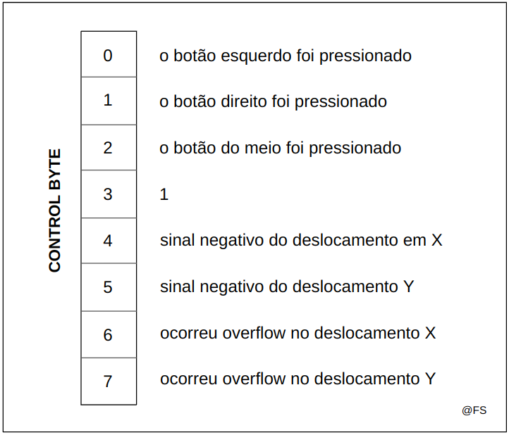

# i8042, the PC's Mouse

## Tópicos

- [Funcionamento do Rato](#rato)
- [i8042 Mouse](#i8042-mouse)
- [O comando 0xD4](#o-comando-0xd4)
- [Interrupções](#interrupções)
- [Máquinas de Estado em C](#maquinas-de-estado-em-c)
- [Compilação do código](#compilação-do-código)
- [Testagem do código](#testagem-do-código)

## Rato

O Sistema Operativo por padrão atribui umas coordenadas iniciais no ecrã ao cursor, por esse motivo aparece sempre na mesma posição quando ligamos o computador. Depois disso o dispositivo emite bytes descrever o valor deslocamento no eixo X, o valor do deslocamento no eixo Y e se houve algum botão pressionado no processo. Todas as seguintes posições do rato são calculadas tendo por base a soma de vetores:

<p align="center">
  
  <p align="center">Interpretação da mudança das coordenadas do cursor</p>
</p><br>

De P1 para P2 houve um deslocamento positivo nos dois eixos mas de P2 para P3 o deslocamento em Y foi negativo. O deslocamento do cursor para fora do quadrante positivo dos eixos não é permitido. Uma forma de controlar a situação é a seguinte:

```c
int update_coordinates(int16_t *x, int16_t *y, int16_t delta_x, int16_t delta_y) {
  *x = max(0, *x + delta_x);
  *y = max(0, *y + delta_y);
  return 0;
}
```

A resolução padrão do Mouse do Minix é 4 contagens por milímetro percorrido. Não é uma contagem muito precisa e depende também do rato usado, pelo que este parâmetro não é explorado em LCOM.

A estrutura do código será semelhante ao Lab anterior:

<p align="center">
  
  <p align="center">Organização do código a implementar</p>
</p><br>

## i8042 Mouse

O rato é controlado pelo mesmo dispositivo do teclado: o i8042. 

<p align="center">
  
  <p align="center">Funcionamento do i8042</p>
</p><br>

Vamos portanto usar as mesmas funções para ler, escrever e consultar o status do controlador:

```c
int read_KBC_status(uint8_t *status);
int write_KBC_command(uint8_t port, uint8_t commandByte);
int read_KBC_output(uint8_t port, uint8_t *output);
```

No entanto precisamos de mais uma verificação quando estivermos a ler o output do i8042. De facto, o controlador i8042 garante a leitura de bytes de ambos os dispositivos: teclado e rato. Se houver interrupções dos dois ao mesmo tempo não sabemos a quem pertence o output. Uma possível solução é adicionar um argumento booleano à função que lê o output para que funcione de acordo com o dispositivo que estamos a tratar. **O bit 5 do status do KBC está a 1 quando o output é do rato e está a 0 quando o output é do teclado**:

```c
int read_KBC_output(uint8_t port, uint8_t *output, uint8_t mouse) {

    uint8_t status;
    uint8_t attemps = 10;
    
    while (attemps) {

        if (read_KBC_status(&status) != 0) {                // lê o status
            printf("Error: Status not available!\n");
            return 1;
        }

        if ((status & BIT(0)) != 0) {                       // o output buffer está cheio, posso ler
            if(util_sys_inb(port, output) != 0){            // leitura do buffer de saída
                printf("Error: Could not read output!\n");
                return 1;
            }
            if((status & BIT(7)) != 0){                     // verifica erro de paridade
                printf("Error: Parity error!\n");           // se existir, descarta
                return 1;
            }
            if((status & BIT(6)) != 0){                     // verifica erro de timeout
                printf("Error: Timeout error!\n");          // se existir, descarta
                return 1;
            }
            if (mouse && !(status & BIT(5))) {              // está à espera do output do rato
                printf("Error: Mouse output not found\n");  // mas o output não é do rato
                return 1;
            } 
            if (!mouse && (status & BIT(5))) {                // está à espera do output do teclado
                printf("Error: Keyboard output not found\n"); // mas o output não é do teclado
                return 1;
            } 
            return 0; // sucesso: output correto lido sem erros de timeout ou de paridade
        }
        tickdelay(micros_to_ticks(20000));
        attemps--;
    }
    return 1; // se ultrapassar o número de tentativas lança um erro
}
```

Agora a leitura e validação do output durante as interrupções pode ser realizada em separado:

```c
if (msg.m_notify.interrupts & keyboard_mask)
  read_KBC_output(0x60, &output, 0);
if (msg.m_notify.interrupts & mouse_mask)
  read_KBC_output(0x60, &output, 1);
```

Ao contrário do teclado, o rato em cada evento acaba por enviar **3 bytes** de informação:
- `CONTROL`, 8 bits sem sinal, indica o sinal da componente X, da componente Y, se houve *overflow* nalguma dessas componentes e algum clique em cada um dos três botões disponíveis no rato;
- `DELTA_X`, 8 bits sem sinal, indica o valor absoluto do deslocamento em X;
- `DELTA_Y`, 8 bits sem sinal, indica o valor absoluto do deslocamento em Y;

<p align="center">
  
  <p align="center">Constituição do CONTROL</p>
</p><br>

O conjunto destes três bytes de informação ordenados chama-se `packet` ou pacote. No caso do sistema ser gerido por interrupções, lê-se sempre um byte por cada interrupção gerada. Se estiver em modo polling, lê-se um byte por cada iteração.

A principal dificuldade é saber onde começa e onde termina cada pacote de dados, já que o envio destes bytes é contínuo. Por simplicidade considera-se que o primeiro byte do pacote, o CONTROL, contém sempre o bit 3 ativo e assim é possível identificá-lo. É uma aproximação grosseira pois nada garante que os bytes seguintes (o deslocamento em X e o deslocamento em Y) também não possuam o mesmo bit ativo. No entanto para a LCF este truque funciona sempre.

Para controlar a sincronização dos bytes gerados precisamos de um conjunto de variáveis globais dentro do ficheiro `mouse.c`:

```c
uint8_t byte_index = 0;       // [0..2]
uint8_t packet[3];            // pacote
uint8_t current_byte;         // o byte mais recente lido
```

A invocação da função `mouse_ih()` quando ocorrer uma interrupção provoca uma atualização no byte lido, que pode ser o primeiro do pacote ou não:

```c
void mouse_ih() {
  read_KBC_output(KBC_WRITE_CMD, &current_byte, 1);
}
```

Para preenchermos o array `packet` corretamente podemos invocar em seguida a função `mouse_sync_bytes()`, que irá avaliar se estamos perante o byte CONTROL ou um byte de deslocamento, de acordo com o índice e o estado do terceiro bit:

```c
void mouse_sync_bytes() {
  if (byte_index == 0 && (current_byte & BIT(3))) { // é o byte CONTROL, o bit 3 está ativo
    mouse_bytes[byte_index]= current_byte;
    byte_index++;
  }
  if (byte_index == 3) {                            // completou o pacote
    do_something_with_packet(&packet);
    byte_index = 0;
  }
  if (byte_index > 0) {                             // recebe os deslocamentos em X e Y
    mouse_bytes[byte_index] = current_byte;
    byte_index++;
  }
}
```

## O comando 0xD4

Apesar do i8042 também ser o controlador do rato, não permite contactar diretamente com o dispositivo. Todos os comandos enviados para o input buffer do i8042 são interpretados e, se for o caso, só enviados para o teclado. 

A ideia agora é inibir essa interpretação para conseguirmos mudar as configurações do rato. Ao injetar o comando `0xD4` no i8042 o próximo comando será enviado diretamente ao rato sem qualquer interpretação. Em consequência, o rato enviará uma resposta ao controlador que pode ser lida através do output buffer, em 0x60. Essa resposta pode ter dois formatos:
- `ACK`, byte 0xFA, quando o comando foi aceite;
- `NACK`, byte 0xFE, quando ocorreu algum erro. Nesse caso todo o comando deve ser enviado novamente, esperando alguns milissegundos por causa do delay do controlador;

<p align="center">
  
  <p align="center">Funcionamento do comando 0xD4</p>
</p><br>

Uma possível implementação do método:

```c
int write_to_mouse(uint8_t command) {

  uint8_t attemps = 10;
  uint8_t mouse_response;

  // Enquanto houver tentativas e a resposta não for satisfatória
  do {
    attemps--;
    if (write_KBC_command(0x64, 0xD4)) return 1;              // Ativar do modo D4 do i8042
    if (write_KBC_command(0x60, command)) return 1;           // O comando para o rato é escrito na porta 0x60
    tickdelay(micros_to_ticks(20000));                        // Esperar alguns milissegundos
    if (read_KBC_output(0x60, &mouse_response, 1)) return 1;  // Ler a resposta do rato pela porta 0x60
  } while (mouse_response != 0xFA && attemps);       

  return 0;
}
```

O modo 0xD4 possui alguns comandos relevantes:
- `0xF5`, desativa o *stream mode*;
- `0xEA`, ativa o *stream mode*;
- `0xF0`, ativa o *remote mode*;
- `0xEB`, manda um *request* de novos dados;

O `Stream Mode` é usado nas interrupções. O `Remote Mode` é usado no polling juntamente com o comando `0xEB` para pedir dados a cada iteração. 

## Interrupções

O rato está presente na `IRQ_LINE 12`. As funções das interrupções são muito semelhantes às anteriores. De igual forma temos que declarar as interrupões como exclusivas:

```c
/* ------ i8042.h ------ */
#define MOUSE_IRQ 12;   

/* ------ mouse.c ------ */
int mouse_hook_id = 2;

// subscribe interrupts
int mouse_subscribe_int (uint8_t *bit_no) {
  if(bit_no == NULL) return 1;   // o apontador tem de ser válido
  *bit_no = BIT(mouse_hook_id);  // a função que chamou esta deve saber qual é a máscara a utilizar
                                 // para detectar as interrupções geradas
  // subscrição das interrupções em modo exclusivo
  return sys_irqsetpolicy(MOUSE_IRQ, IRQ_REENABLE | IRQ_EXCLUSIVE, &mouse_hook_id);
}

// unsubscribe interrupts
int mouse_unsubscribe_int () {
  return sys_irqrmpolicy(&mouse_hook_id); // desligar as interrupções
}
```

## Máquinas de Estado em C

A gestão das interrupções geradas pelos dispositivos estudados até aqui pode constituir um modo de `Event Driven Design`. Nesse caso o fluxo do programa é controlado pelo ambiente onde está inserido, ou seja, é reativo na resposta aos eventos (interrupções) que poderão ocorrer de forma assíncrona. No entanto, para o contexto do Projeto de LCOM este *design* de código não é suficiente para garantirmos um código robusto, modular e facilmente manipulável. A função do Lab4 `mouse_test_gesture(uint8_t x_len, uint8_t tolerance)` é um exemplo bom e complexo para explorar.

A ideia é desenhar um símbolo AND (V invertido) com o rato garantindo várias restrições:
- A primeira linha deve ser desenhada SÓ com o botão esquerdo pressionado;
- A segunda linha deve ser desenhada SÓ com o botão direito pressionado;
- No vértice o botão esquerdo tem de deixar de ser pressionado antes do botão direito ser;
- O valor absoluto da inclinação em cada linha deve ser maior que 1;
- O deslocamento em X não pode ser inferior a x_len; 
- Há uma tolerância de algumas unidades, tolerance, em cada iteração para cada eixo;
- O fim de cada linha é marcado pela libertação do botão;
- Um erro na execução faz com que o sistema volte ao estado inicial;

Este sistema tem demasiadas restrições para ser implementado com base em variáveis booleanas e cadeias de condições if-else. No entantanto podemos pensar no mesmo como um conjunto de estados:

- Estado inicial, Start (S)
- Linha ascendente, Up (U)
- Vértice, Vertex (V)
- Linha descendente, Down (D)
- Estado final, End (E)

A transição entre um estado e outro ocorre depois de cumprida uma determinada condição. Caso essa condição não seja cumprida o sistema ou permanece no mesmo estado ou deverá retornar ao estado inicial. De acordo com a matéria lecionada em Teoria da Computação o enunciado da função pode ser representado pela seguinte Máquina de Estados:

<p align="center">
  
  <p align="center">Máquina de Estados que representa o fluxo do programa</p>
</p><br>

Descrição das transições:

- I: botão esquerdo é pressionado
- II: o botão esquerdo está pressionado enquanto o movimento do rato é ascendente com declive superior a 1;
- III: o botão esquerdo deixa de estar pressionado
- IV: o botão direito é pressionado
- V: o botão direito está pressionado enquanto o movimento do rato é descendente com declive inferior a -1;
- VI: o botão direito deixa de estar pressionado e o deslocamento no eixo X foi superior ou igual a x_len;
- F: corresponde à transição ELSE. Caso a condição atual não corresponda a uma manutenção do estado atual (*self-transition*) ou avanço para o seguinte estado, então o sistema deve voltar ao inicial.

Em C um conjunto de estados pode ser programado usando uma enumeração:

```c
typedef enum {
  START,
  UP,
  VERTEX,
  DOWN,
  END
} SystemState;
```

// soon

## Compilação do código

Ao longo do Lab4 programamos em 2 ficheiros:

- `mouse.c`, para implementação das funções referentes a interrupções, sincronização de pacotes e comandos enviados diretamente ao rato;
- `lab4.c`, para implementação das funções de mais alto nível que usam as funções disponíveis no módulo do *mouse*;

Ainda importamos os ficheiros `utils.c`, `timer.c`, `i8254.h`, `i8042.h` e `KBC.c` do lab anterior. Em LCOM o processo de compilação é simples pois existe sempre um makefile que auxilia na tarefa. Para compilar basta correr os seguintes comandos:

```bash
minix$ make clean # apaga os binários temporários
minix$ make       # compila o programa
```

## Testagem do código

A biblioteca LCF (*LCOM Framework*) disponível nesta versão do Minix3 tem um conjunto de testes para cada função a implementar em `lab4.c`. Assim é simples verificar se o programa corre como esperado para depois ser usado sem problemas no projeto. Para saber o conjunto dos testes disponíveis basta consultar:

```bash
minix$ lcom_run lab4
```

Neste caso em concreto estão disponíveis algumas combinações:

```bash
minix$ lcom_run lab4 "packet <NUMBER_PACKETS> -t <0,1,2,3,4,5>"
minix$ lcom_run lab4 "async <TIME_SECONDS> -t <0,1,2,3,4,5>"
minix$ lcom_run lab4 "remote <TIME_MILLISECONDS> -t <0,1,2,3,4,5>"
minix$ lcom_run lab4 "gesture <X_LENGTH> <TOLERANCE> -t <0,1,2,3,4,5>"
```

---

@ Fábio Sá <br>
@ Março de 2023