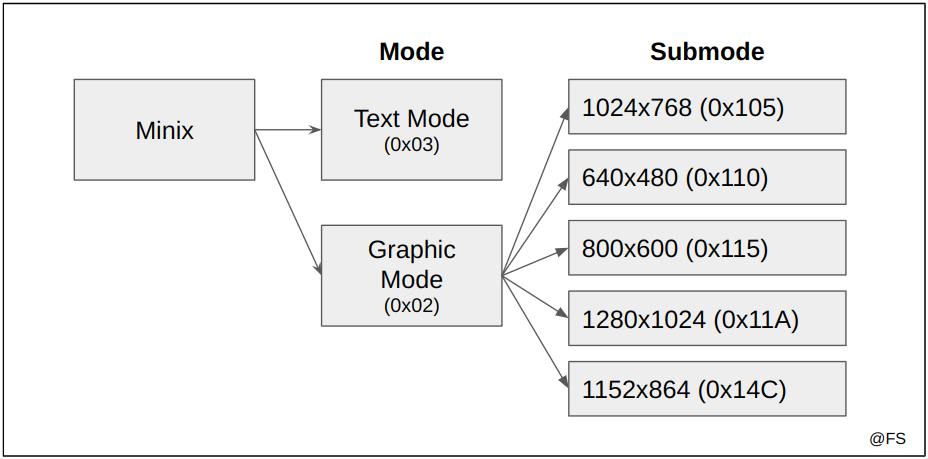
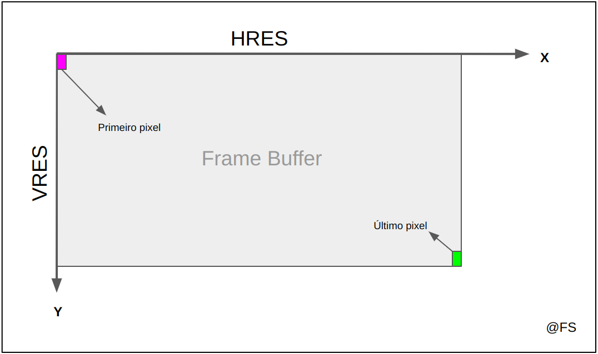
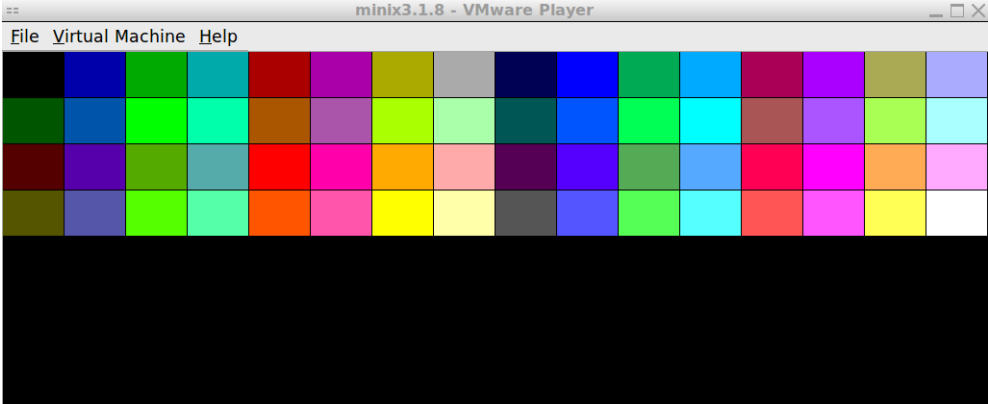

# Video Card

## Tópicos

- [Video Modes](#video-modes)
- [Mapeamento da Video RAM](#mapeamento-da-video-ram)
- [XMP](#xmp)
- [Compilação do código](#compilação-do-código)
- [Testagem do código](#testagem-do-código)

## Video Modes

O Minix possui dois modos de funcionamento:
- `Text Mode`, o modo padrão do terminal que vimos até agora;
- `Graphic Mode`, o que vamos explorar neste Lab5. Existem alguns modos gráficos que permitem variar o ecrã ao nível da dimensão (resolução vertical e horizontal), no tipo de cores disponíveis e de como estas estão mapeadas na memória;

<p align="center">
  
  <p align="center">Modos do Minix</p>
</p><br>

Para utilizar o modo gráfico é necessário configurá-lo através da Video Bios Extension (VBE). Este método usa duas novas ferramentas:
- uma nova *system call*, a `sys_int86`, para injetar na BIOS o comando pretendido em kernel mode;
- uma estrutura `reg86_t` que suporta um conjunto de instruções que serão passadas como argumento da função anterior;

A estrutura reg86_t possui alguns parâmetros de 16 bits cujo valor depende da configuração:

<p align="center">

| Parâmetro reg86_t | Text Mode | Graphic Mode       |
|-------------------|-----------|--------------------|
| ah                | 0x00      | 0x4F               |
| al                | Ox03      | 0x02               |
| ax                | 0x0003    | 0x4F02             |
| bx                | 0x0000    | submode \| BIT(14) |
| intno             | 0x10      | 0x10               |

</p>

AX pode ser interpretado como dois parâmetros de 8 bits: o AH (*higher bits*) e AL (*lower bits*), sendo AL responsável por determinar o modo de funcionamento (0x02 ou 0x03). BX representa o submodo de funcionamento no modo gráfico. BX também possui o BIT 14 ativo para tornar o mapeamento da memória `linear`. O parâmetro "intno" é 0x10 nos dois casos.

Dado um submodo de funcionamento, a mudança para o respectivo modo gráfico pode ser realizada recorrendo à seguinte implementação:

```c
int set_graphic_mode(uint16_t submode) {
    reg86_t reg86;
    memset(&reg86, 0, sizeof(reg86)); // inicialização da estrutura com o valor 0 em todos os parâmetros
    reg86.intno = 0x10;               // intno é sempre 0x10      
    reg86.ah = 0x4F;                  // parte mais significativa de AX
    reg86.al = 0x02;                  // parte menos significativa de AX. 0x02 no caso de modo gráfico
    // reg86.ax = 0x4F02;             // equivamente às duas últimas instruções
    reg86.bx = submode | BIT(14);     // determinação do submodo com memória linear
    if (sys_int86(&reg86) != 0) {     // se houver algum erro, abortar a função
        printf("Set graphic mode failed\n");
        return 1;
    }
    return 0;
}
```

Tal como nos labs anteriores é importante deixar o Minix no mesmo estado por motivos de integridade do sistema. Assim é necessário voltar ao modo de texto antes de retornar qualquer função que use o modo gráfico. Uma possível solução:

```c
int set_text_mode() {
    reg86_t reg86;                       
    memset(&reg86, 0, sizeof(reg86));   // inicialização da estrutura com o valor 0 em todos os parâmetros
    reg86.intno = 0x10;                 // intno é sempre 0x10 
    reg86.ah = 0x00;                    // parte mais significativa de AX 
    reg86.al = 0x03;                    // parte menos significativa de AX. 0x03 no caso de modo texto
    // reg86.ax = 0x0003;               // equivamente às duas últimas instruções
    reg86.bx = 0x0000;                  // não há submodo no modo de texto
    if(sys_int86(&reg86) != 0) {        // se houver algum erro, abortar a função
        printf("Set text mode failed\n");
        return 1;
    }
    return 0;
}
```

## Mapeamento da Video RAM

A VRAM (*Video RAM*) é a memória que contém informação sobre a cor de cada píxel presente no ecrã. Antes de mudar o Minix para o modo gráfico é importante alocar memória suficiente de acordo com o submodo escolhido. Ao conjunto de memória alocada dá-se o nome de `frame buffer`.

<p align="center">
  
  <p align="center">Frame Buffer</p>
</p><br>

A VRAM no modo gráfico é sempre `linear` e contínua, ou seja, a matriz de cores é na realidade um array contínuo de bytes. O seu tamanho depende:
- da resolução horizontal do modo;
- da resolução vertical do modo;
. do modelo de cores escolhido;
- do número de bytes que representam a cor de cada píxel;

| Mode  | Screen Resolution | Color Model  | Bits per pixel (R:G:B) |
|-------|-------------------|--------------|------------------------|
| 0x105 | 1024x768          | Indexed      | 8                      |
| 0x110 | 640x480           | Direct color | 15((1:)5:5:5)          |
| 0x115 | 800x600           | Direct color | 24 (8:8:8)             |
| 0x11A | 1280x1024         | Direct color | 16 (5:6:5)             |
| 0x14C | 1152x864          | Direct color | 32 ((8:)8:8:8)         |

Conhecendo HRES (resolução horizontal) é possível encontrar o índice do píxel que corresponde às coordenadas 2D do frame buffer:

```c
int pixel_index(uint16_t x, uint16_t y) {
    return y * HRES + x;
}
```

As cores podem vir em dois formatos:
- `Modelo direto`: a cor é um conjunto de bytes que representam cada uma das componentes RGB (red, green, blue) do píxel.
- `Modelo indexado`: a cor é previamente mapeada numa paleta de cores do Minix e apenas é necessário o índice dessa cor;

<p align="center">
  
  <p align="center">Paleta de cores indexadas do Minix</p>
</p><br>

Nesta versão do Minix estão disponíveis 64 cores indexadas. Sabendo as características de cada modo é simples calcular o número de bytes de memória a alocar. Por exemplo:

```c
unsigned int frame_0x105_bytes = 1024 x 768  x 1; // 8 bits = 1 byte
unsigned int frame_0x11A_bytes = 1280 x 1024 x 2; // 16 bits = 2 bytes
```

A LCF (*LCOM Framework*) já possui uma função que retorna os dados de cada modo e uma estrutura que comporta toda essa informação:

```c
vbe_mode_info_t mode_info;                          // declaração da estrutura
memset(&mode_info, 0, sizeof(mode_info));           // inicialmente todos os valores são 0
if (vbe_get_mode_info(mode, &mode_info)) return 1;  // preenchimento dos valores
```

Os parâmetros importantes de vbe_mode_info_t são os seguintes:

- `PhysBasePtr` - endereço físico do início do frame buffer;
- `XResolution` - resolução horizontal, em píxeis;
- `YResolution` - resolução vertical, em píxeis;
- `BitsPerPixel` - número de bits por píxel;
- `<COLOR>MaskSize` - número de bits da máscara de cores no modo direto. No modo 0x11A GreenMaskSize = 6;
- `<COLOR>FieldPosition` - posição da máscara de cores. No modo 0x11A GreenFieldPosition = 5;
- `MemoryModel` - 0x06 se for em modo direto, 0x105 se for em modo indexado;

Onde \<COLOR\> pode uma qualquer cor primária do sistema RGB: Red, Green ou Blue. 

A LCF também possui uma estrutura `minix_mem_range` que suporta o endereço físico base e o endereço físico final do frame buffer a alocar e *system calls* que transformam esses endereços de memória física em memória virtual. De acordo com a unidade curricular de Sistemas Operativos um programa só deve lidar com endereços de memória virtual.

```c
/* variáveis globais no ficheiro graphic.c */

// estrutura de dados que contém informação sobre o modo gráfico
vbe_mode_info_t mode_info; 
// apontador para o início da memória virtual 
uint8_t *frame_buffer;

/* função de mapeamento da VRAM */
int set_frame_buffer(uint16_t mode){

  // retirar informação sobre o @mode
  memset(&mode_info, 0, sizeof(mode_info));
  if(vbe_get_mode_info(mode, &mode_info)) return 1;

  // cálculo do tamanho do frame buffer, em bytes
  unsigned int frame_size = (mode_info.XResolution * mode_info.YResolution * mode_info.BitsPerPixel) / 8;
  
  // preenchimento dos endereços físicos
  struct minix_mem_range physic_addresses;
  physic_addresses.mr_base = mode_info.PhysBasePtr; // início físico do buffer
  physic_addresses.mr_limit = physic_addresses.mr_base + frame_size; // fim físico do buffer
  
  // alocação física da memória necessária para o frame buffer
  if (sys_privctl(SELF, SYS_PRIV_ADD_MEM, &physic_addresses)) {
    printf("Physical memory allocation error\n");
    return 1;
  }

  // alocação virtual da memória necessária para o frame buffer
  frame_buffer = vm_map_phys(SELF, (void*) physic_addresses.mr_base, frame_size);
  if (frame_buffer == NULL) {
    printf("Virtual memory allocation error");
    return 1;
  }

  return 0;
}
```

Com o frame buffer instanciado, podemos inserir qualquer cor em qualquer posição:

```c
int paint_pixel(uint16_t x, uint16_t y, uint32_t color) {

  // As coordenadas têm de ser válidas
  if(x >= mode_info.XResolution || y >= mode_info.YResolution) return 1;
  
  // Cálculo dos Bytes per pixel da cor escolhida. Arredondamento por excesso.
  unsigned BytesPerPixel = (mode_info.BitsPerPixel + 7) / 8;

  // Índice (em bytes) da zona do píxel a colorir
  unsigned int index = (mode_info.XResolution * y + x) * BytesPerPixel;

  // A partir da zona de memória frame_buffer[index], copia @BytesPerPixel bytes da @color
  memcpy(&frame_buffer[index], &color, BytesPerPixel);

  return 0;
}
```

## XPM

X PixMap (XPM) é uma forma de representação de imagens. O ficheiro fornecido [pixmap.h](./pixmap.h) possui alguns exemplos no formato interpretado pelo Minix. Exemplo:

```c
static xpm_row_t const pic1[] = {
  "32 13 4",
  "  0",
  "x 2",
  "o 14",
  "+ 4",
  "                                ",
  "              xxx               ",
  "            xxxxxxx             ",
  "         xxxxxx+xxxxxx          ",
  "      xxxxxxx+++++xxxxxxx       ",
  "    xxxxxxx+++++++++xxxxxxx     ",
  "    xxxxxxx+++++++++xxxxxxx     ",
  "      xxxxxxx+++++xxxxxxx       ",
  "         xxxxxx+xxxxxx          ",
  "          ooxxxxxxxoo           ",
  "       ooo           ooo        ",
  "     ooo               ooo      ",
  "   ooo                   ooo    "};
```

A primeira linha revela, por ordem:
- O número de colunas da imagem;
- O número de linhas da imagem;
- O número de cores que a imagem contém;
- Opcional: o número de caracteres por píxel. Se omitido, este valor é 1;

Em seguida há a descrição das cores. Cada linha possui dois ou três argumentos:
- Se o número de argumentos da linha for dois (como no exemplo), o modo de cores é indexado;
- Se o número de argumentos da linha for três, o modo de cores é direto e o terceiro argumento é a representação hexadecimal da cor em formato RGB;

A LCF providencia funções e estruturas de dados para lidar com XPMs:

```c
uint8_t *xpm_load(xpm_map_t map, enum xpm_image_type type, xpm_image_t *img);
```

A descrição e tipo dos argumentos podem ser encontrados [aqui](https://paginas.fe.up.pt/~pfs/aulas/lcom2020/labs/lab5/src/doc/group__xpm.html#ga069eaae77c9b41a9a04ea81666119493). Assim é possível criar uma função que imprime em modo gráfico uma imagem XPM:

```c
int print_xpm(xpm_map_t xpm, uint16_t x, uint16_t y) {

  xpm_image_t img;

  // retorna um apontador para um array de cores preenchido de acordo com o XPM
  // atualiza @img com o valor do comprimento e altura da imagem
  uint8_t *colors = xpm_load(xpm, XPM_INDEXED, &img);
  if (colors == NULL) return 1;

  for (int h = 0 ; h < img.height ; h++) {
    for (int w = 0 ; w < img.width ; w++) {
      if (vg_draw_pixel(x + w, y + h, *colors) != 0) return 1;
      colors++; // avança para a próxima cor
    }
  }
  return 0;
}
```

## Compilação do código

Ao longo do Lab5 programamos em 2 ficheiros:

- `graphics.c`, para implementação das funções referentes à manipulação da memória, cores e XPMs;
- `lab5.c`, para implementação das funções de mais alto nível que usam as funções disponíveis no módulo do *graphics*;

Ainda importamos os ficheiros `utils.c`, `timer.c`, `i8254.h`, `i8042.h`, `KBC.c` e `keyboard.c` dos labs anteriores. O ficheiro `pixmap.h` também foi adicionado. Em LCOM o processo de compilação é simples pois existe sempre um makefile que auxilia na tarefa. Para compilar basta correr os seguintes comandos:

```bash
minix$ make clean # apaga os binários temporários
minix$ make       # compila o programa
```

## Testagem do código

// soon

---

@ Fábio Sá <br>
@ Março de 2023