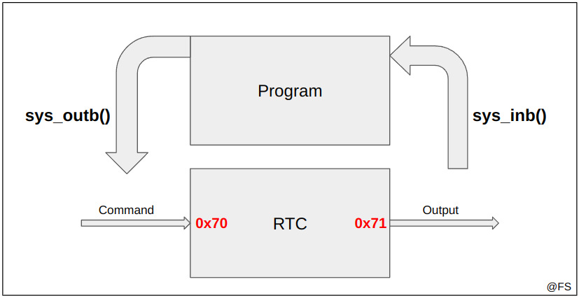

# Real Time Clock

## Tópicos

- [Funcionamento](#funcionamento)
- [Interrupções](#interrupções)
- [BCD vs Binário](#bcd-vs-binário)

## Funcionamento

O RTC (*Real Time Clock*) tem um funcionamento semelhante ao [Timer](../lab2/). Possui 6 contadores internos, cada um correspondendo a um parâmetro da data ou hora:

- Ano (0 a 99)
- Mês (1 a 12)
- Dia (1 a 31)
- Hora (0 a 24)
- Minuto (0 a 59)
- Segundo (0 a 59)

<br>
<p align="center">
  
  <p align="center">Real Time Clock</p>
</p><br>

Sempre que quisermos ler algo do RTC (ler configurações ou ler os contadores internos) é preciso primeiro avisá-lo, escrevendo no registo de controlo (`0x70`) o comando adequado de 8 bits. A leitura é feita posteriormente pelo registo de output, `0x71`, também com 8 bits.

```c
int rtc_output(uint8_t command, uint8_t *output) {
    if (sys_outb(0x70, command) != 0) return 1;
    if (util_sys_inb(0x71, output) != 0) return 1;
    return 0;
}
```

A tabela seguinte mostra os comandos relevantes para LCOM:

| Comando | Leitura de...                                                                                                     |
|---------|-------------------------------------------------------------------------------------------------------------------|
| 0       | Segundos                                                                                                          |
| 2       | Minutos                                                                                                           |
| 4       | Horas                                                                                                             |
| 7       | Dias                                                                                                              |
| 8       | Meses                                                                                                             |
| 9       | Anos                                                                                                              |
| 10      | Update status. Se o BIT 7 estiver ativo o RTC está a atualizar algum dos contadores internos. internos                            |
| 11      | Counting status. Se o BIT 2 estiver ativo o RTC possui os contadores em binário, caso contrário conta em formato BCD |

Antes de qualquer leitura de um dos seis contadores internos é necessário confirmar que o RTC não está a atualizar valores. Qualquer leitura durante uma atualização poderá dar resultados errados. Uma forma de verificar é com a seguinte função booleana: 

```c
int rtc_is_updating() {
    uint8_t result;
    if (rtc_output(10, &result)) return 1;
	return result & BIT(7);
}
```

Agora sim dá para ler os valores com segurança. Exemplo: atualização do valor das horas:

```c
int rtc_update_time(uint8_t *hours) {
    
    // Se o RTC estiver ocupado a atualizar os contadores não devemos ler dados
    if (rtc_is_updating() != 0) return 1;

    // Leitura das horas -> comando 4
    if (rtc_output(4, hours) != 0) return 1;
    return 0;
}
```

## Interrupções

O RTC também funciona com base em interrupções e estas podem ser ativadas e desativadas de forma semelhante aos outros dispositivos. O IRQ_LINE a usar é 8.

```c
#define IRQ_RTC 8;
int rtc_hook_id = 5; // qualquer valor [0..7] que não tenha sido usado pelos outros dispositivos

int rtc_subscribe_interrupts(uint8_t *bit_no) {
    if (bit_no == NULL) return 1;
    return sys_irqsetpolicy(IRQ_RTC, IRQ_REENABLE, &rtc_hook_id);
}

int rtc_unsubscribe_interrupts() {
    return sys_irqrmpolicy(&rtc_hook_id);
}
```

É natural que o RTC crie várias interrupções por segundo devido ao seu funcionamento interno. Como o processo de leitura de todos os seis contadores internos é um processo mais complexo, é necessário fazer algumas **otimizações** para que não torne o programa lento.

Por exemplo, podemos atualizar os dados (reler os contadores internos) apenas quando o número de segundos muda. Uma forma possível de implementar o sistema é usar este dispositivo juntamente com o Timer. Admitindo uma frequência de 60Hz, o número de segundos muda quando o número de interrupções do timer for múltiplo de 60 (timer_interrupts % 60 == 0):

```c
int timer_interrupts = 0; // Contador de interrupções do timer

// Função chamada sempre que há interrupção do timer
void update_timer() {
    timer_interrupts++:
}

// Função chamada sempre que há interrupção do RTC
void update_rtc() {
    if (timer_interrupts % 60 == 0) update_timer_info();
}
```

## BCD vs Binário

Os contadores internos podem estar a ser incrementados em dois modos: modo binário ou modo BCD. Para descobrir o modo podemos consultar o `counting status` através do comando 11. É binário se o BIT 2 estiver ativo:

```c
int rtc_is_binary() {
    uint8_t status;
    if (rtc_output(11, &status)) return 1;
	return status & BIT(2);
}
```

No caso dos contadores estarem em modo BCD é necessário fazer a conversão.

```note
0011 1000 // Binário = 2^3 + 2^4 + 2^5 = 56
   3    8 // BCD = (0011) * 10^1 + (1000) * 10^0 = 38
```

Em C a tradução pode ser implementada da seguinte forma:

```c
uint8_t to_binary(uint8_t bcd_number) {
    return ((bcd_number >> 4) * 10) + (bcd_number & 0xF);
}
```

---

@ Fábio Sá <br>
@ Abril de 2023