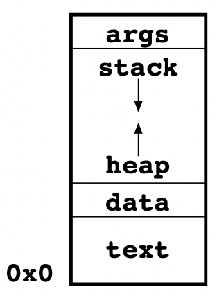

# 1 - Introduction

## Programa vs Processo

### Programa

Pedaço de código com um conjunto de instruções que pode ser executado pelo processador.

### Processo

Abstração do sistema operativo de um programa em execução

## Utilização da memória

A memória é usada em diversas partes para assegurar o bom funcionamento dos programas. Há 5 partes principais:

1. args - argumentos passados pela linha de comando