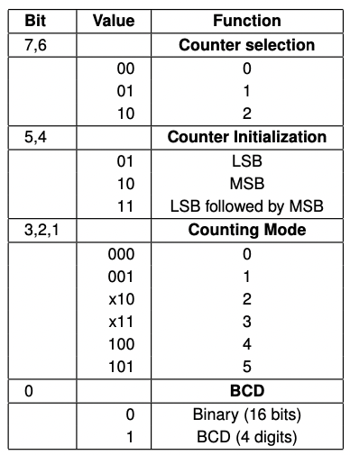

# 3 - Timer / Counter

O temporizador do computador, também conhecido como i8254, é um dos mais básicos tipos de harware que podemos programar na linguagem C.  
Cada computador tem a funcionalidade de medir um tempo preciso, por exemplo, um processo ou a rapidez do processador.  

### Existem assim 3 contadores de 16 bits. Cada um:

- pode contar de `forma binária` (com zeros e uns somente), ou usando o sistema `BCD` (*binary-coded decimal*);
- tem 6 modos de contagem, todos eles começam com um valor inicial e decrescem até chegar a zero. O modo a adoptar para as aulas laboratoriais e para a cadeira num todo é o `Mode 3` (0b011), que é "Square Wave Generator", uma vez que até metade do tempo está a 1 e na outra metade está a 0, recuperando o valor original no final de cada período;
- os contadores têm portas `0x40`, `0x41` e `0x42` correspondentemente;
- tem um registo de controlo na porta `0x43`;
- MSB e LSB servem para guardar o número a inicializar no contador;

## Registo de Controlo (0x43)

### Para configuração de um Timer

 

 

Tabela de construção do control register em 0x43

 

- bit `0`: 0 para contagem binária, 1 para contagem BCD;
- bit `1, 2, 3`: para decisão do modo de contagem. Para a cadeira, modo 3 = 011;
- bit `4, 5`: 01 para LSB, 10 para MSB, 11 para LSB seguido de MSB. Para a cadeira, modo 11, com as duas partes, ou então só o LSB com MSB = 0x00;
- bit `6, 7`: para decisão do contador a utilizar (para operações in/out);

### Para leitura da configuração de um Timer ou o valor do contador

 

 

Tabela de construção do control register em 0x43

 

- bit `0`: 0 para contagem binária, 1 para contagem BCD;
- bit `1, 2, 3`: para escolher qual ou quais timers a consultar. Para cada 1, 1 bit é necessário;
- bit `4`: 0 se for para ler o estado, 1 caso contrário. Nesta cadeira é importante;
- bit `5`: 0 se for para ler a contagem atual, 1 caso contrário. Nesta cadeira não é tão importante;
- bit `6, 7`: 11 obrigatório se for para leitura da configuração atual do Timer;

