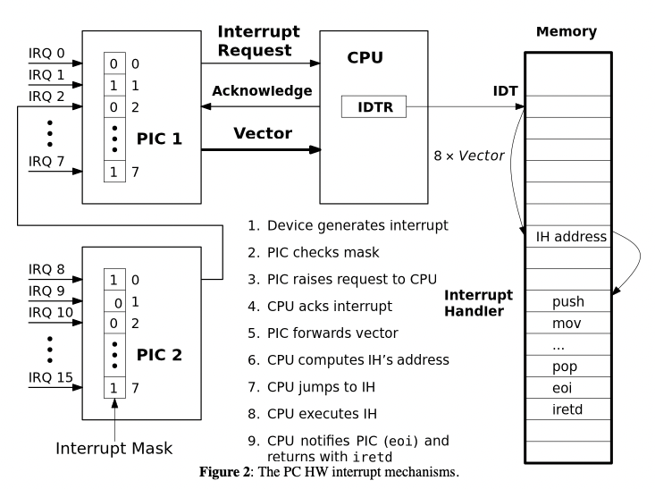

# 4 - Interrupts

A ligação do processador com um I/O event é feita em duas formas:
1. `Polling`: o processador lê o estado do dispositivo de tempos em tempos para ver se este necessita de transferência de dados;
2. `Interrupts`: o dispositivo notifica o processador com uma interrupção, de modo a receber atenção;

Todas as interrupções são processadas usando o PIC (*Priority Interrupt Controller*). No caso do *i8259* existe 8 interrupt request (IRQ), que vão de IRQ0 (maior prioridade, corresponde ao timer) ao IRQ15 (menor prioridade). Pode ser ainda usada uma máscara, que são 16 bits que correspondem às 16 linhas de interrupção, permitindo (1) ou não (0) a propagação da interrupção para o CPU.

 

O PIC envia então ao processador um vector, de valores de oito bits, que correspondem a uma posição de uma tabela de memória onde estão os endereços para cada subrotina a executar de I/O do dispositivo em questão. 

| PIC | Controller Register | Interrupt Mask Register |
| :--- | :----: | ---: |
| PIC1 | 0x20 | 0x21 |
| PIC2 | 0xA0 | 0xA1 |