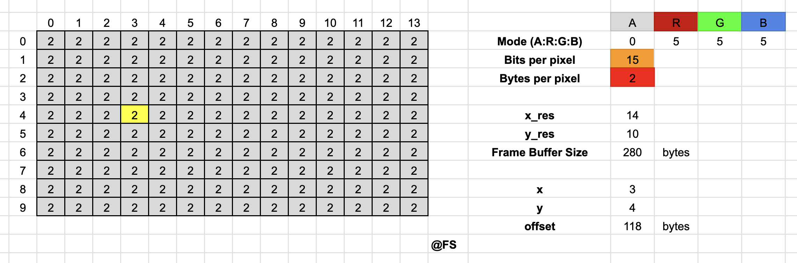

# Laboratório de Computadores (LC) - Year 2, Semester 2 (Y2S2)

## :warning: Note regarding LCOM 24/25 edition :warning:

Although I am no longer officially involved in this course unit, I will continue to collaborate to improve teaching by maintaining this repository, all explanations and code. Therefore, I ask that if you see any errors or find parts that are not well-explained, please contact me. Let's all collaborate for better education.

-----

This repository contains all the exercises and assessments of the UC Laboratório de Computadores, taught by [Pedro Ferreira Souto](https://sigarra.up.pt/feup/pt/func_geral.formview?p_codigo=238172) and [Pedro Brandão](https://sigarra.up.pt/feup/pt/func_geral.formview?p_codigo=246574) at [Integrated Master in Informatics and Computing Engineering](https://sigarra.up.pt/feup/pt/cur_geral.cur_view?pv_curso_id=742) [MIEIC] at the [Faculty of Engineering of the University of Porto](https://sigarra.up.pt/feup/pt/web_page.Inicial) [FEUP].  

<h2 align = "center" >Final Grade: 19/20</h2>

  

## LCOM Documentation. <a href="https://fabio-a-sa.github.io/Y2S2-LabComputadores/">Website Version</a>

I was LCOM monitor in the year 2022/2023 of the classes 2LEIC06 and 2LEIC10 with Professor [Nuno Cardoso](https://sigarra.up.pt/feup/pt/func_geral.FormView?p_codigo=683234). Initially, I started to build this repository to be able to explain the subject in a simple but complete way during the practical classes, making them dynamic, fun, and attractive. But in a short time, I ended up extending the notes to the entire subject of the curricular unit. 

Thus, except for the serial port module, this documentation covers all devices given in lectures, exercises, and notes also for the final project. It doesn't hurt to help students understand the subject better. It was a pleasure together with Professor Nuno to be able to captivate the students and in the end, when we received all the positive feedback, we realized that we made the right choices.

All schematics, illustrations, texts, code snippets, and resolutions are my own. Any doubts or questions can contact me through my email, up202007658@up.pt. I would be very happy to help.

### 1. Labs

In [recommendations](./Labs/README.md), you can find the ideal structure of the labs to be developed in practical classes, as well as some notes on the best way to program in LCOM. In [Lab0](./Labs/lab0/) you can find relevant aspects of Language C in the context of this Curricular Unit. Handling arguments, masks, macros, and shifts is a big step toward success here.

Each lab activity is accompanied by a detailed explanation of the theory as well as the implementation of the corresponding device, with commented and documented code. I didn't hide any details, I gave importance to the really important parts, topics referring to the main problems/faults and their solutions. Likewise, the explanation is sequential, without jumps, so that knowledge is more easily obtained. All the tricks to success can be found here:

- [Recommendations](./Labs/)
- [Lab0](./Labs/lab0/README.md) - The C language
- [Lab2](./Labs/lab2/) - i8254, the PC's Timer
- [Lab3](./Labs/lab3/) - i8042, the PC's Keyboard
- [Lab4](./Labs/lab4/) - i8042, the PC's Mouse
- [Lab5](./Labs/lab5/) - Video Card
- [Extra](./Labs/lab6/) - Real Time Clock

### 2. Interactive Frame Buffer

Resource for Lab 5, Video Card. Sometimes the calculations and offsets may not be very clear. In 2023, I created an Excel sheet that helps visualize them. It's available [here](https://docs.google.com/spreadsheets/d/1aaTiOUk965avtSCn7fpoqJcOiJpvunK_QaXHsfLqf9M/edit?usp=sharing).

Since the shared sheet is read-only, feel free to inspect all formulas, copy and paste them to a sheet where it can be edited. Learning by doing, rather than just in theory, is much better.

### 3. Template

A simple template for the final LCOM project. Brings together relevant aspects for the final LCOM project, such as tips, algorithms, guidelines on code structure, and possible optimizations, among others.

- [Code](./Template/)

Seeing things working in practice is much better than in theory, and this Template was useful for the student's first interaction with the learned devices, as well as for understanding the importance of Minix optimizations. Feel free to clone, run, modify and change what you find relevant.

### 4. PP

Given that two years have passed and this edition (24/25) will certainly bring updates to the Curricular Unit, I decided to create this folder containing the (possible) solutions for the practical parts. Please note that:

- The test instructions ("enunciados") have always been circulating around;
- The pseudo-solutions have also always been circulating, they just weren’t available here and were often incorrect or incomplete;
- Obviously, each of the `pp_X.c` files does not work individually in Minix and cannot be run or compiled. The test LCF version, which is only available during assessments, is always required;

Enjoy!

## Gertic-- (Grade: 18.9 / 20)

  

Final project carried out in the year 2021/2022 at the time I was on the course as a student. Gertic-- is inspired by the well-known game [Gartic](https://gartic.io) and implemented to contain all devices taught in LCOM.

  

Members:
- [x] Fábio Sá, up202007658 
- [x] Inês Gaspar, up202007210 
- [x] Lourenço Gonçalves, up202004816 
- [x] Marcos Pinto, up201800177

**@ Fábio Araújo de Sá**  
**2021/2022/2023/2024/2025**
