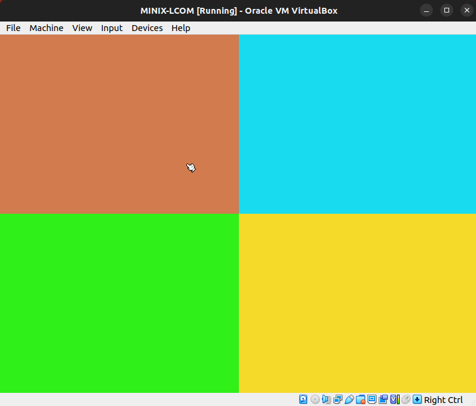
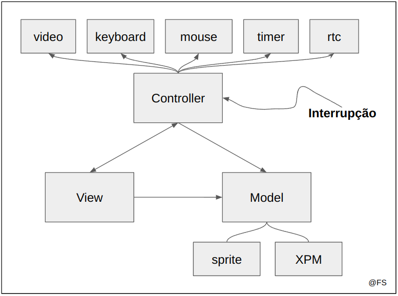
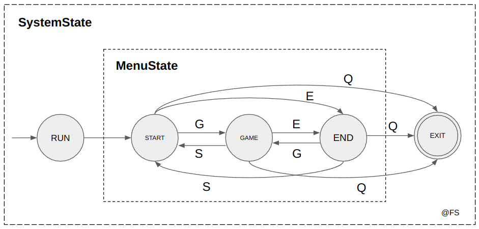
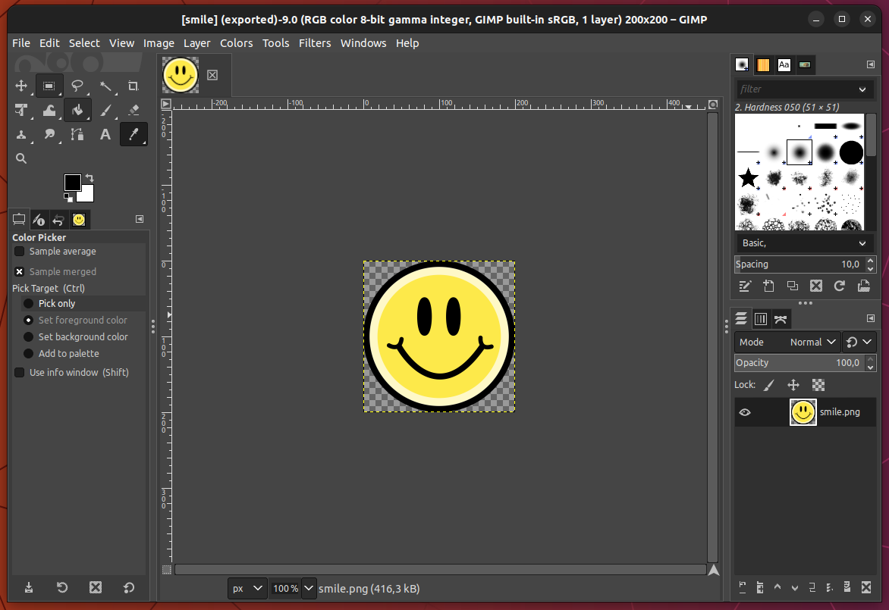
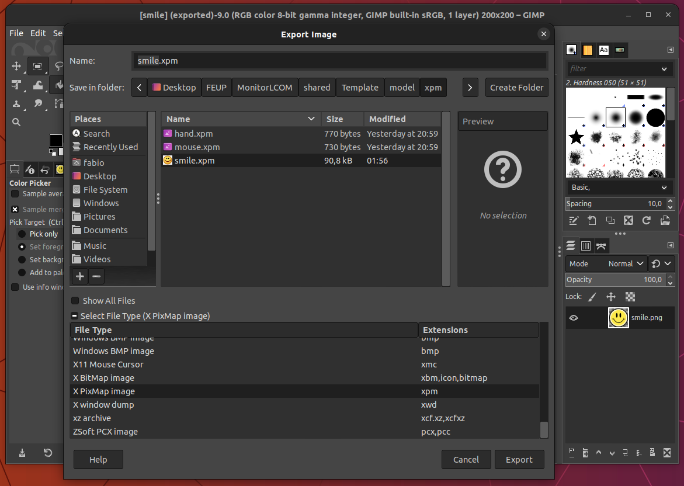
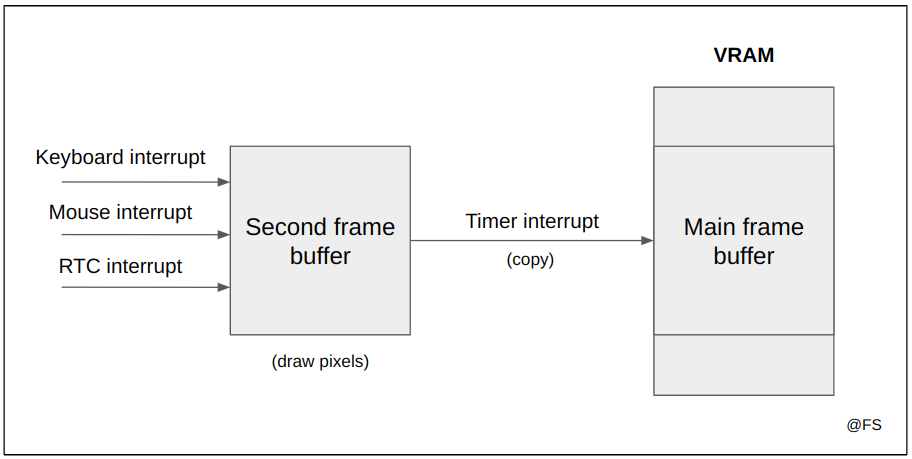

# Template

Este template reune aspetos relevantes para o projeto final de LCOM, como dicas, algoritmos, orientação na estruturação do código, otimizações possíveis entre outros.

## Tópicos

- [Setup](#setup)
- [Funcionalidades implementadas](#funcionalidades-implementadas)
- [Estrutura MVC](#estrutura-mvc)
- [Orientação a Objetos em C](#orientação-a-objetos-em-c)
- [Máquinas de Estado em C](#máquinas-de-estado-em-c)
- [XPM em modo direto](#xpm-em-modo-direto)
    - [Gerar XPMs](#gerar-xpms)
    - [Desenhar XPMs](#desenhar-xpms)
- [Otimizações](#otimizações)
    - [Flags de compilação](#flags-de-compilação)
    - [Double Buffering](#flags-de-compilação)
    - [Operações frequentes](#operações-frequentes)
- [Debug](#debug)

## Setup

O template pode ser executado com as seguintes instruções:

```bash
$ git clone https://github.com/Fabio-A-Sa/Y2S2-LabComputadores.git
$ cd Y2S2-LabComputadores/Template
$ make clean && make
$ lcom_run proj
```

O programa depende das configurações colocadas em `config.h`. É possível mudar a frequência, tamanhos de ecrã, modos de cores e verificar a importância da otimização [double buffering](#double-buffering).

```c
#define GAME_FREQUENCY      60     // 30
#define VIDEO_MODE          0x115  // 0x14C
#define DOUBLE_BUFFER       1      // 0
```

Com a variação destes parâmetros conclui-se que:
- Uma frequência superior a 60 Hz não apresenta ganhos significativos;
- Modos superiores a 0x115 podem ser lentos (maior memória manipulada, mais bytes por pixel, maior resolução);
- A aplicação implementada com **double buffering** é substancialmente mais fluída;

## Funcionalidades implementadas

Apesar do programa não fazer nada de útil, apresenta praticamente todos os truques necessários para realizar o projeto: gestos do cursor, cliques, lidar com diferentes objetos, diferentes menus e interação entre os diversos dispositivos.

O template tem três menus:
- A tecla `S` acede ao menu start;
- A tecla `G` acede ao menu game;
- A tecla `E` acede ao menu end;

Em qualquer momento, a tecla `Q` permite terminar a execução. Em todos os menus o cursor está presente e funcional.

<p align="center">
  
  <p align="center">Menu G</p>
</p><br>

No menu `G` é possível clicar num de quatro botões, alterando a cor do quadrante respetivo. O cursor nesta etapa tem outro formato além do tradicional.

## Estrutura MVC

Baseado nos [slides](https://web.fe.up.pt/~arestivo/slides/?s=patterns#58) do André Restivo.

<p align="center">
  
  <p align="center">MVC</p>
</p>

#### Model

O modelo conhece os objetos do programa, como Botões, o Cursor, Sprites, o estado do Menu, o estado do Sistema. As interrupções tratadas no controlador afetam diretamente o modelo e as interações entre os objetos através de [máquinas de estado](#máquinas-de-estado-em-c).

#### Controller

Contém todos os controladores dos dispositivos implementados durante as aulas práticas. Todas as funções de alto nível, nomeadamente as presentes em ficheiros labX.c, foram eliminadas. De igual forma partes do código foram modificadas para uma melhor modularidade. Por exemplo:
- Agora a [subscrição das interrupções](./controller/timer/timer.h) é realizadas sem passagem da máscara como argumento;
- A estrura mouse_info_t foi substituida por [MouseInfo](./controller/mouse/mouse.h), que é mais compacta e adaptada às necessidades da aplicação; 
- [VBE.h](./controller/video/VBE.h) agora também contém as cores manipuladas pela VRAM;

#### View

Módulo que trata da representação visual do modelo sempre que há uma interrupção por parte do timer.

## Orientação a Objetos em C

O objeto Sprite, usado para criar e manipular os elementos do cenário, é na realidade uma struct:

```c
typedef struct {
    uint16_t height;    // altura, em pixeis
    uint16_t width;     // largura, em pixeis
    uint32_t *colors;   // array de cores, se for criado a partir de um XPM
    uint32_t color;     // cor única, se for um rectângulo simples como o botão
    uint8_t pressed;    // indica se o objeto foi pressionado pelo rato
} Sprite; 
```

Por motivos de eficiência nem sempre são criados com XPM. Por exemplo, no caso do botões que têm cor única, é aconselhável usar apenas o parâmetro *color* e não preencher o array *colors*:

```c
#include "xpm/mouse.xpm"

Sprite *mouse;
Sprite *button1;

void setup_sprites() {
    mouse = create_sprite_xpm((xpm_map_t) mouse_xpm);
    button1 = create_sprite_button(mode_info.XResolution/2, mode_info.YResolution/2, ORANGE);
}

Sprite *create_sprite_xpm(xpm_map_t sprite);
Sprite *create_sprite_button(uint16_t width, uint16_t height, uint32_t color);
```

Ao lidar com apontadores e alocação dinâmica de memória é possível tratar a estrutura como se fosse um objeto em C++:

```c
void update_buttons_state() {
    if (mouse_info.left_click) {
        if (mouse_info.x < mode_info.XResolution/2 && mouse_info.y < mode_info.YResolution/2)
            button1->pressed = 1;
        //...
    }
}
```

É boa prática antes de acabar o programa libertar a memória alocada:

```c
void destroy_sprite(Sprite *sprite) {
    if (sprite == NULL) return;
    if (sprite->colors) free(sprite->colors);
    free(sprite);
    sprite = NULL;
}
```

## Máquinas de Estado em C

A gestão das interrupções geradas pelos dispositivos estudados até aqui pode constituir um modo de `Event Driven Design`. Nesse caso o fluxo do programa é controlado pelo ambiente onde está inserido, ou seja, é reativo na resposta aos eventos (interrupções) que poderão ocorrer de forma assíncrona. No entanto, para o contexto do Projeto de LCOM este *design* de código não é suficiente para garantirmos um código robusto, modular e facilmente manipulável. [Aqui](../Labs/lab4/README.md#máquinas-de-estado-em-c) há um exemplo mais complexo do que o apresentado de seguida.

A transição entre menus é semelhante a transições numa máquina de estados:

<p align="center">
  
  <p align="center">Máquina de Estados para Menus</p>
</p><br>

Em C um conjunto de estados pode ser programado usando uma enumeração e as transições com recurso a switch-case:

```c
typedef enum {
    RUNNING,
    EXIT,
} SystemState;

typedef enum {
    START,
    GAME,
    END
} MenuState;

// condições iniciais
SystemState systemState = RUNNING;
MenuState menuState = START;

// a máquina de estados é atualizada de acordo com 
// o valor do scancode lido em cada interrupção
void update_keyboard_state() {
    (kbc_ih)();
    switch (scancode) {
        case Q_KEY:
            systemState = EXIT;
            break;
        case S_KEY:
            menuState = START;
            break;
        case G_KEY:
            menuState = GAME;
            break;
        case E_KEY:
            menuState = END;
        default:
            break;
    }
}
```

A atualização do estado tem consequências imediatas. Do lado do módulo View, o estado é consultado e a partir daí é escolhido o menu a desenhar no novo frame:

```c
extern MenuState menuState;

void draw_new_frame() {
    switch (menuState) {
        case START:
            draw_initial_menu();
            break;
        case GAME:
            draw_game_menu();
            break;
        case END:
            draw_finish_menu();
            break;
    }
    draw_mouse();
}
```

A ordem da pintura é importante. Segundo o [Algoritmo do Pintor](https://pt.wikipedia.org/wiki/Algoritmo_do_pintor), por questões de visibilidade pinta-se primeiro os píxeis mais afastados (o fundo da tela, o menu), sobrepondo os píxeis de objetos mais próximos (o cursor, os botões). 

## XPM em modo direto

X PixMap (XPM) é uma forma de representação de imagens. O ficheiro fornecido no [lab5](../Labs/lab5/pixmap.h) possuia alguns exemplos de XPMs com cores no formato indexado. Para o projeto convém utilizar XPMs em modo direto e em princípio é possível gerar qualquer imagem XPM a partir de uma imagem JPG ou PNG. Sugere-se usar imagens com cor de fundo constante e não muito grandes.

### Gerar XPMs

O software gratuito que permite gerar XPMs de forma mais simples é o [GIMP](https://www.gimp.org/). Ao abrir uma imagem qualquer:

<p align="center">
  
  <p align="center">Abrir uma imagem</p>
</p><br>

Em "File > Export As.." dá para renomear a imagem de output e escolher o formato XPM:

<p align="center">
  
  <p align="center">Exportar para formato XPM</p>
</p><br>

O ficheiro gerado é [este](./model/xpm/smile.xpm):

```c
static char * smile_xpm[] = {
    "200 200 621 2",
    "  	c #FFFFFE",  // Cor transparente
    ". 	c #000000",
    "+ 	c #060606",
//...
```

### Desenhar XPMs

A forma de lidar com XPMs de cor direta é diferente da indicada nos Labs. Primeiro temos de garantir que a cor de fundo é uma cor conhecida para poder ser ignorada na altura de alterar os pixeis do frame buffer. Por exemplo, no caso do template foi escolhida a cor 0xFFFFFE, que só difere 1 bit do valor máximo permitido em RGB, logo será pouco provável que apareça como uma cor relevante na imagem. Essa será a cor transparente.

```c
#define TRANSPARENTE 0xFFFFFE

#include "xpm/smile.xpm"
Sprite *smile;

void setup_sprites() {
    smile = create_sprite_xpm((xpm_map_t) smile_xpm);
}
```

A função `create_sprite_xpm` constroi um array de cores de acordo com a estrutura do XMP dado como parâmetro:

```c
Sprite *create_sprite_xpm(xpm_map_t sprite){

  Sprite *sp = (Sprite *) malloc (sizeof(Sprite));
  if( sp == NULL ) return NULL;

  xpm_image_t img;
  sp->colors = (uint32_t *) xpm_load(sprite, XPM_8_8_8_8, &img);
  sp->height = img.height;
  sp->width = img.width;

  if( sp->colors == NULL ) {
    free(sp);
    return NULL;
  }
  return sp;
}
```

A imagem é processada pixel a pixel, com consulta da cor dos pixeis no array do sprite. Se a cor consultada for igual à transparente não ocorre nenhuma cópia. Assim há garantias de transparência desta parte do frame:

```c
int draw_sprite_xpm(Sprite *sprite, int x, int y) { 
    uint16_t height = sprite->height;
    uint16_t width = sprite->width;
    uint32_t current_color;
    for (int h = 0 ; h < height ; h++) {
      for (int w = 0 ; w < width ; w++) {
        current_color = sprite->colors[w + h*width];
        if (current_color == TRANSPARENTE) continue;
        if (draw_pixel(x + w, y + h, current_color, drawing_frame_buffer) != 0) return 1;
      }
    }
    return 0; 
}
```

## Otimizações

### Flags de compilação

As flags de compilação `-O2` e `-D_LCOM_OPTIMIZED_` ajudam o compilador a otimizar o código para o Minix. É importante utilizá-las para garantir uma execução mais fluída. No makefile:

```makefile
CFLAGS += -pedantic -D_LCOM_OPTIMIZED_ -O2
```

### Double Buffering

É a principal e mais importante otimização a usar no projeto. Em `config.h`, ao desativar a flag `DOUBLE_BUFFER` é possível notar que o ecrã do template fica muito mais travado. O fenómeno é chamado de [Flicker Screen](https://en.wikipedia.org/wiki/Flicker_(screen)) e ocorre porque o mesmo frame buffer é usado, simultaneamente, para:
- suportar qualquer mudança de posição ou cor dos objetos do ecrã;
- imprimir o ecrã píxel a píxel;

Assim, mesmo com uma frequência baixa é muito provável que a consulta de um pixel seja acompanhada por uma atualização do frame todo, causando um delay não desejado.

A solução clássica usada na Computação Gráfica é termos com dois buffers:

- O primeiro buffer, o buffer principal que é o único que tem tradução física na VRAM, apenas é atualizado quando ocorre uma interrupção do timer. A atualização é uma cópia integral do conteúdo do segundo buffer para este;
- O segundo buffer, o buffer secundário, é atualizado sempre que haja alguma mudança de estado dos objetos que compõem o ecrã;

<p align="center">
  
  <p align="center">Double Buffering</p>
</p><br>

```c
uint8_t *main_frame_buffer;
uint8_t *secondary_frame_buffer;
uint32_t frame_buffer_size;

// Tratamento da interrupção do timer
void update_timer_state() {
    swap_buffers();
}

// Tratamento da interrupção do Mouse
void update_mouse_state() {
    (mouse_ih)();
    mouse_sync_bytes();
    if (byte_index == 3) {
        mouse_sync_info();
        update_buttons_state();
        draw_new_frame(); // Desenha a atualização no frame buffer secundário
        byte_index = 0;
    }
}

// Cópia de todo o conteúdo do buffer secundário para o primário
void swap_buffers() {
    memcpy(main_frame_buffer, secondary_frame_buffer, frame_buffer_size);
}
```

#### Vantagens

- O fenómeno Flicker Screen deixa de ser visível;
- Solução simples de implementar;

#### Desvantagens

- Gasta o dobro da memória;
- A cópia da memória do buffer secundário para o principal tem complexidade temporal O(N), linear com o tamanho do buffer;
- Há um delay entre uma interrupção de um dispositivo e a mudança visual do estado afetado por essa interrupção. Esse delay é de no máximo (1/frequência) segundos;

### Operações frequentes

Devemos evitar fazer a mesma operação binária várias vezes. Por exemplo, uma implementação *naive* da função `swap_buffers()` anterior poderia ser a seguinte:

```c
void swap_buffers() {
    memcpy(main_frame_buffer, secondary_frame_buffer, 
                mode_info.XResolution * mode_info.YResolution * ((mode_info.BitsPerPixel + 7) / 8));
}
```

Por cada interrupção do Timer ocorrem duas multiplicações, uma soma e uma divisão. Se considerarmos um funcionamento normal de 60 Hz, 60 interrupções por segundo portanto, ocorrem 60*(2+1+1)=240 operações por segundo só neste passo. Uma possível solução para ser mais eficiente:

```c
uint32_t frame_buffer_size;

int set_frame_buffers(uint16_t mode) {
    //...
    frame_buffer_size = mode_info.XResolution * mode_info.YResolution * ((mode_info.BitsPerPixel + 7) / 8);
    //...
}

void swap_buffers() {
    memcpy(main_frame_buffer, secondary_frame_buffer, frame_buffer_size);
}
```

Com este pequeno truque poupamos milhares e milhares de operações aritméticas ao processador durante a execução do projeto. O Minix agracede.

## Debug

A LCF (*LCOM Framework*) proporciona uma ferramenta de debug que escreve em dois ficheiros:
- `output.txt`, contém todos os outputs da última execução do projeto;
- `trace.txt`, contém a ordem das chamadas das funções, os tipos e valores de retorno de cada uma delas;

O path do ficheiro a ser escrito na função **main** depende da configuração de cada máquina virtual. Para descobrir a string correcta, dentro da pasta desejada na consola do Minix executa-se o comando:

```bash
$ pwd # /home/lcom/labs/Template/debug
```

No meu caso direcionei os ficheiros escritos para o diretório `/debug` para ficarem mais organizados.

```c
int (main)(int argc, char *argv[]) {
  lcf_set_language("EN-US");
  lcf_trace_calls("/home/lcom/labs/Template/debug/trace.txt");
  lcf_log_output("/home/lcom/labs/Template/debug/output.txt");
  if (lcf_start(argc, argv)) return 1;
  lcf_cleanup();
  return 0;
}
```

---

@ Fábio Sá <br>
@ Abril de 2023